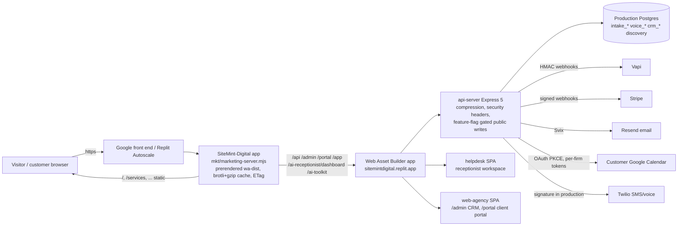
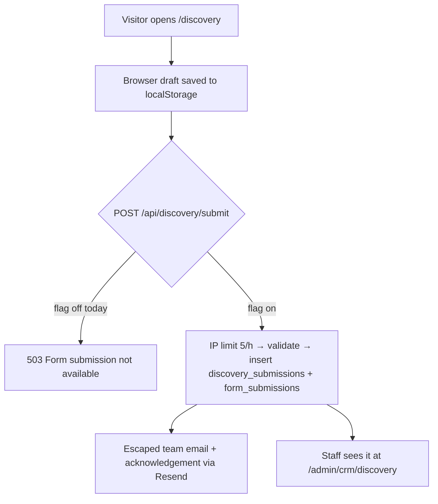

# Launch audit and release candidate — 24 September 2026

Observed evidence and a reviewable release candidate. This is not a launch certificate. Section 0 gives the decision per surface; every claim below names the test that produced it. Nothing in this pass sent a customer message, made a call, charged a card, changed a credential, pushed a branch, published a deployment, or touched a database.

## 0. Launch decision per surface

| Surface | Decision | Why |
| --- | --- | --- |
| Public marketing site (`sitemintdigital.com`) | **Ready to publish this candidate** once the owner approves the push and the marketing transfer | 20 public routes verified at 375 px and desktop on the candidate: zero horizontal overflow, one H1 each, no console errors, both broken anchors fixed, mobile hero/demo/receptionist films working, wordmark restart verified, Lighthouse 90–100 on the candidate. |
| Discovery → CRM (the "Start a project" journey) | **NOT ready — blocked on the owner** | Production `POST /api/discovery/submit` returns **503 "Form submission is not currently available"** (`PUBLIC_FORM_SUBMISSIONS_ENABLED` is off in the deployed backend). The form renders and saves a browser draft, but no lead can reach the CRM today. Enable the flag, then run one real submission and confirm the CRM row (§9). |
| Backend / API (Web Asset Builder) | **Candidate only — needs its own publish** | Small, reviewed hardening landed here (§2.3). Typecheck, build and 1,723 non-database tests pass. Not deployed by this pass; the backend is a separate deploy unit. |
| Receptionist workspace | **Assisted onboarding only; not verified in this pass** | Public registration is open in production (endpoint answers with validation, not 503). Verified email → setup → calendar → publish → call was not exercised: it needs an authorized test tenant and provider activity that this pass was not authorized to create. Prior certification evidence remains the reference (M4 calendar write, 2026-09-02, staging). |
| Staff CRM | **Not verified in this pass** | One staff account exists in production (`staffCount: 1`). Sign-in, TOTP, permissions and record journeys need the owner's own session; no credentials were used. |
| Client portal | **Not verified in this pass** | `/portal/sign-in` renders on the domain and rejects bad credentials (401). An invited-client session was not available. |
| Database index packet `0003` | **Rehearsal required before production** | Additive, reviewed, contract-tested (89 checks). Must be rehearsed against a scratch copy per `lib/db/MIGRATIONS.md` before any production application. |

**Release executed later the same day (owner authorisation of 2026-09-24). The decision table above is superseded by §0a.**

## 0a. Release record and evidence-based decision (2026-09-24, ~22:30–22:50 UTC)

| Item | Value |
| --- | --- |
| Source commits | `a3e859c` (frontend + server + hardening), `1e1d162` (marketing package), `6d0b8ba` (owner-authorised protected-file fixes + discovery mail guard), `fbca269` (manifest hashed on git-stored bytes), `c1cc75b` (test models the trusted proxy hop). Branch `claude/sitemint-launch-audit-7c01bb`, pushed to GitHub. |
| Marketing deploy (SiteMint-Digital app) | `mkt/` checked out from the branch by git (`sha256sum -c MANIFEST.sha256`: 344/344 OK), committed on the workspace branch as `46e48a9c4`, smoke-tested on :8093 (brotli, ETag, 404, health), Republished. Rollback copy `mkt.rollback-before-a3e859c` in the workspace. Live `release.json` reports `sourceCommit a3e859c`. |
| Backend deploy (Web Asset Builder) | Workspace was on `feature/ai-receptionist-visible-progress` @ `2543c0c9` (12 local commits, 7 of 8 edited source files byte-identical to the canonical tip, the 8th a legacy file no longer routed) — preserved as `backup/replit-before-launch-2026-09-24`; checked out `c1cc75b`; `pnpm install --frozen-lockfile`; api-server, helpdesk and web-agency built explicitly in the workspace; deployment secret `PUBLIC_FORM_SUBMISSIONS_ENABLED=true` added; database-copy switch verified off; **Stripe sandbox-sync switch found ON again and turned off**; published, build `8ad3901e-cd12-4025-8176-da530c48f6b6`, no migration gate raised. |
| Public "Start a project" journey — LIVE proof | `POST /api/discovery/submit` empty body → 400 validation (was 503). One named acceptance inquiry ("SiteMint Launch Acceptance Test", company "SiteMint Digital (internal acceptance 2026-09-23T22:46Z)", email claidyklaydetaguran@gmail.com) → 201 `id 9`. Production database (`neondb`, via the workspace's `SNAPSHOT_SOURCE`, read-only, non-PII columns): `discovery_submissions` id 9 status New, lead_score 1; `form_submissions` id 8 "Discovery Form" `email_team_sent=sent`, `email_client_sent=sent`. Acknowledgement received by claidyklaydetaguran@gmail.com from noreply@sitemintdigital.com at 22:46:42Z ("Thank You for Contacting SiteMint Digital"). Team notification to info.sitemint@gmail.com is evidenced by the `sent` status only (that mailbox was not read). |
| Staff CRM view of the inquiry | **Not verified.** `/admin/crm/discovery` lists `discovery_submissions`, but no staff session was available to this pass; the row is confirmed in the database, not on the screen. |
| Live gates after publish | `/api/healthz` ok, `/api/readyz` ready; no `X-Powered-By`; `X-Frame-Options: DENY`, `X-Content-Type-Options`, `Referrer-Policy` present; `Vary: Accept-Encoding` on API responses (compression middleware active; small bodies below the 1 KB threshold stay identity); unsigned intake SMS webhook → 403 with empty TwiML (signature enforced in production); register → 400 on empty body; contact → 400 on empty body (flag on). |
| Local pre-release verification (scratch Postgres `crm_test`) | Validation 400; valid submission 201 + both rows; mail-layer failure recorded on the row (not a 500); forged `X-Forwarded-For` per request: 4×201 then **429**; SMS STOP → `<Response></Response>`; login limiter 10×401 then 429; api-server full suite with database: 2,330 passed / 1 failed (that test forged the header — corrected in `c1cc75b`, 157 pass on rerun); `moduleRegistration.test` fails only in the rsync'd tree that has no `.git`. |
| Lighthouse, production, same conditions before/after | See §6 (live rows). Mobile homepage 86 → **95**, LCP 3.2 → 2.4 s, document TTFB 1,160 → 260 ms; receptionist mobile 89 → **96**; desktops 96 / 98. |

**Decision — public website: LAUNCHED and verified on the domain.** **Decision — Discovery → CRM journey: LAUNCHED; persistence and both emails verified in production; the staff CRM screen itself was not opened.** Staff CRM, client portal and receptionist end-to-end use **remain unverified** (no session, no tenant, no provider activity in this pass).

Security disposition of the two production-exposed findings: (1) rate-limit IP spoofing — fixed in `authRateLimit.ts` (owner-named): only the entry appended by the trusted edge counts (`TRUSTED_PROXY_HOPS`, default 1 in production); consequence: public forms submitted through the marketing proxy share the proxy's egress bucket (coarser, unforgeable); to key on the visitor address behind the proxy set `TRUSTED_PROXY_HOPS=2` on the backend deployment only after confirming direct `*.replit.app` traffic is blocked or accepted as sharing one bucket. (2) unescaped intake email — fixed in `intakeAgent.ts` (owner-named) with tests; Twilio body logging now records keys only. Twilio routing, opt-out and credentials untouched; protected-file diff limited to those two files (0 lines on every other protected file).

Rollback (not needed): marketing → restore `mkt.rollback-before-a3e859c` and Republish; backend → Replit "Manage" → previous deployment `4cc08726…` (published 2026-09-23), or `git checkout backup/replit-before-launch-2026-09-24`, rebuild, Republish; secret `PUBLIC_FORM_SUBMISSIONS_ENABLED` can be removed to close the form again.

## 0b. Follow-up release (2026-09-24, later): iPhone Safari hero, button icons and receptionist language, CI and public-form limits

Owner-reported after the launch. Scope limited to these three items; production release and Discovery drafts preserved.

### 1. Real iPhone Safari hero

**Diagnosis (from the media stack, confirmed by the fix design; no real iPhone was available to this session).** The film itself is sound: H.264 Main level 4.0, yuv420p, `moov` at the front (`faststart`), 12-frame keyframe interval on the mobile rendition, HTTP 206 byte ranges verified on the domain, poster in place. The failure is Safari behaviour, not encoding: Safari (macOS and iOS) does not paint a `<video>` frame for a `currentTime` change until playback has started at least once, and iOS ignores `preload` until `load()` or `play()` is called. The previous hero only ever seeked, so on Safari the element stayed transparent over the poster and "did nothing", while Chromium emulation (which paints seeked frames without playback) looked correct. In Low Power Mode iOS additionally rejects `play()` for muted inline media.

**Fix (`MintCinemaHero.tsx`).** The hero now calls `load()`, waits for metadata, then *primes* the film with a muted inline `play()` immediately followed by `pause()`; scrubbing starts only after priming, and the film is kept transparent until then so the poster paints. If `play()` rejects (Low Power Mode / policy), the media errors, or metadata never arrives (4 s retry, 9 s cut-off), the hero switches to a **frame sequence**: 36 frames of the same approved leaf film (2.4 per second, 720 px WebP, 283 KB total, preloaded then swapped by scroll progress). Reduced-motion and data-saver still get the poster only and never download a film. `?herodebug=1` overlays a live readout (mode, primed, readyState, networkState, duration, currentTime, progress, error, UA). Verified on the candidate: video mode primes and scrubs (8.8 s → 11.9 s across the sticky section); with `play()` forced to reject, mode switches to frames, all 36 load, and scrolling moves frame 18 → 36. No console errors.

**Device test to perform (2 minutes, iPhone Safari).** Open `https://sitemintdigital.com/?herodebug=1` after this release is live. Report: iOS version and iPhone model; whether Low Power Mode is on; the readout's `mode` (`video` or `frames`), `primed`, `readyState`, `error`; whether the leaf moves as you scroll the first screen; then scroll to "See how it comes together" and say whether the demonstration plays by itself or shows a "Play the demonstration" button; open `/ai-receptionist` and say whether the background film moves and whether the round pause button pauses it. Repeat once with Low Power Mode on. The readout is the diagnostic; the leaf moving is the acceptance.

### 2. Button icons and receptionist language

- The button arrow was CSS `content: "↗"` (U+2197 has emoji presentation on iOS); `.more` links, the challenge picker, "Back to top", "Explore below", "Live site", "Meet …" and "Review my project summary" used similar text glyphs. All replaced by one `MintArrow` inline SVG (stroke `currentColor`, `aria-hidden`, rotated for right/down/up) and, for the pseudo-element arrows, a CSS mask of the same path filled with `currentColor`; hover/focus rotate the arrow, disabled dims it. A test forbids any text-glyph arrow in the public Mint components and pages.
- Wording: "Request pilot pricing" → **Request pricing** (receptionist page, Start hero); "Email us for pilot pricing" replaced by a "Request pricing" button that leads to the working discovery brief (persisted and acknowledged since the launch), with the mailbox kept as a plain secondary link; the supporting explanation and the single assisted-setup sentence now read exactly as the owner specified; "Assisted pilot" badges/kicker replaced by **Set up with you** on signup, receptionist sign-in and the Work page; FAQ and About prose no longer say "pilot". No price is stated anywhere; caller SMS is still described as not included.

### 3. CI and public-form limits

- **CI run 35930549913 (`CI / gates`)** failed on `v4FoundationContract` "renders the footer after `<main>`", which asserted `PublicShell` markup retired when `chrome="v4"` started delegating to `MintChrome`. The rule is kept and now asserted against `MintChrome.tsx` (the shipped shell). Because the scripts chain stops at its first failure, that check had been hiding two more stale helpdesk Overview checks (tier labels "Available now"/"In development", retired 2026-09-17; the empty-state sentence) and three synthetic secret-scan hits (a trust-mode local scratch cluster URL in `journey.mjs` and `CONTINUATION.md`, example.com hosts in `dbTargetContract.test.ts`). All updated or allowlisted with justification; nothing skipped. The next gate, "Disposable-database journal proofs" (`journalIntegration.test.ts`), then failed on every migrate case with the guard message "no database target named": the suite predates the `--target` guard and spawned `migrate:*` without one, so it had never passed in CI. It now passes the same claim an operator makes (`--target dev --expect-db <its disposable database> --expect-fingerprint <the URL fingerprint from the guard's own helper>`) for the guarded commands only; `push` and `baseline:journals` are unchanged. 58/58 pass on the local scratch cluster. A wrong expectation still fails the child, so no guard behaviour is bypassed. Local CI-equivalent: root typecheck 0 errors; every contract in the chain passes; api-server 1,739 tests, web-agency 190; helpdesk disabled build + boundary scan clean; secret scan 0 findings.
- **Shared-bucket lockout.** Trusted chain: visitor → Replit edge (marketing app, appends the visitor address) → `marketing-server.mjs` → Replit edge (Web Asset Builder, appends the marketing server's egress address) → API. With one trusted hop the API keys every website visitor on the marketing egress, so five submissions locked everyone out for an hour. Fix: the marketing server forwards the address *its* edge observed (rightmost X-Forwarded-For entry, never a caller-written one) as `x-sitemint-visitor` with an HMAC-SHA256 signature over `PROXY_VISITOR_SECRET`, after stripping any client-supplied copy; the API keys limits on that identity only when the signature verifies, so a direct `*.replit.app` caller cannot mint one and keeps the strict per-address limit. Until the secret is configured on **both** apps the header is not sent/honoured and the shared bucket allows **20/hour** instead of 5 (`publicFormLimit`); once configured, unverified keys can only be direct callers and return to 5/hour. Tests: 6 new signature/limit cases; local proof of the previous fix stands (forged headers 4×201 then 429). **Owner action:** create one random secret (for example `openssl rand -hex 32`) and add it as `PROXY_VISITOR_SECRET` in the Secrets of both the SiteMint-Digital and Web Asset Builder apps, then republish both; this session does not enter secrets into fields.

### 4. Release record (2026-09-24, ~09:55–10:10 UTC)

- **Commits (branch `claude/sitemint-launch-followup-0924`, PR #33 → `design/mint-clarity-public-release`):** 19055af (frontend, server, limiter, tests), 2f92976 (mkt package for 19055af), c87bf7b (this record), b2742e3 (journal-proof test fix). Base tip was still 8a45d94 at merge time; fast-forward.
- **CI:** run 35936224409 on b2742e3 is green (gates + voice-matrix): https://github.com/claidyklaydetaguran-dev/SiteMint-Digital/actions/runs/35936224409. The earlier failure (35930549913) and the journal-proof failure it had been hiding (35935346519) are both resolved without skipping any test.
- **Published.** Marketing (SiteMint-Digital app): `mkt` at 19055af, manifest 380/380 verified in the workspace before publish, rollback copy `~/workspace/mkt.rollback-before-19055af`; live `release.json` reports `sourceCommit 19055af`. Backend (Web Asset Builder): workspace at b2742e3 (differs from 19055af only in a test file and this document), `dist/index.mjs` rebuilt explicitly before Republish; DB-copy and Stripe sandbox-sync switches confirmed off (the Stripe switch had re-enabled itself again and was turned off first).
- **Live verification (no rows created; empty bodies only).** `/api/readyz` ready; discovery/contact/register empty bodies → 400 with the same validation messages as before; unsigned STOP → 403 empty TwiML. Seven empty contact posts, each with a different forged `X-Forwarded-For`, all returned 400 (the previous code returned 429 on the sixth); forged `x-sitemint-visitor`/`-sig` → 400 (ignored, no 500); a second client on a different egress (a Replit shell) → 400. Home: `?herodebug=1` readout renders, `mode: video`, `primed: true`, `readyState 4`; all 36 frame images are referenced by the deployed bundle and served (`leaf-01-*.webp` 200, image/webp). Deployed CSS: 4 mask arrows, 0 glyph `content` rules; pages /, /ai-receptionist, /pricing, /start, /services, /about contain 0 arrow glyphs and 0 occurrences of "pilot pricing"/"Assisted pilot"; `/start?service=ai-receptionist` renders the "Request pricing" block with both approved sentences and its primary action goes to `/discovery`. Brotli, ETag/304, hardening headers and byte-range 206 unchanged.
- **Not verified here:** any real iPhone (owner device test in §0b.1), CRM, portal, receptionist calls, SMS, billing. Rate-limit keys are still the interim shared 20/hour bucket until `PROXY_VISITOR_SECRET` is set on both apps and both are republished (owner action above).

## 1. Baseline reconciliation

| Question | Answer (verified 2026-09-24) |
| --- | --- |
| Canonical source branch | `origin/design/mint-clarity-public-release`, tip `d082ad6` (2026-09-23). It is a strict superset of every other branch: `main` is 499 commits behind and 0 ahead; `feature/ai-receptionist-visible-progress`, `feature/ai-receptionist-private-beta-readiness`, `feature/ar-pilot-functional`, all `security/*`, `phase/*`, `lifecycle/*`, `hardening/*` and `release/*` branches are fully contained (0 commits ahead). Only `release/marketing-dist-2026-09-16` carries 2 packaging commits of its own. |
| Working branch for this candidate | `claude/sitemint-launch-audit-7c01bb`, re-based onto the canonical tip (was on `main`). |
| Production public site | `https://sitemintdigital.com/release.json` reports `sourceCommit b58a537` — a commit on the canonical branch. Matches the handoff. |
| Production backend | `/api/healthz` 200, `/api/readyz` 200 `{"status":"ready"}` through the domain. Registration endpoint open; discovery, contact and landing analytics writes **off**; invite signup off; CORS allowlist correct (an untrusted origin receives no allow-origin header). |
| Deploy topology (as observed) | Domain → Replit app **SiteMint-Digital** (Autoscale, Google front end) running `mkt/marketing-server.mjs`, which serves `mkt/wa-dist` (prerendered web-agency build) and reverse-proxies `/api`, `/admin`, `/portal`, `/app`, `/ai-toolkit`, `/ai-receptionist/dashboard` to Replit app **Web Asset Builder** (`sitemintdigital.replit.app`), which runs the api-server, the receptionist dashboard, CRM and portal SPA and owns the production database. |
| Replit-only repairs from the handoff | Neither exists in this checkout: there is no "Unknown caller" fallback (a test forbids it), and `VoiceModelTab` was renamed `VoiceTab`, which already uses `findVoicePreset`. Nothing to reconcile in source. |
| Known Discovery contract type errors | Not reproducible here: `tsc` for web-agency, helpdesk, api-server and `lib/db` all exit 0 on this branch. The mismatch reported by the handoff lives in the Replit workspace's diverged working tree, not in the canonical source. The fix is to deploy the backend from this branch, not to patch types. |
| Roadmap file | `docs/roadmap/ACTIVE.md` still described the AR-001 program; superseded by this document (header updated). |

**Source of truth per surface:** public site = `artifacts/web-agency` built + prerendered into `mkt/wa-dist`; staff CRM and client portal = `artifacts/web-agency` served by Web Asset Builder at `/admin` and `/portal`; receptionist workspace = `artifacts/helpdesk` at `/ai-receptionist/dashboard`; API = `artifacts/api-server`. All four are on the same branch and were built from it in this pass.

## 2. Changes in this release candidate

### 2.1 Public frontend (`artifacts/web-agency`)

- **Mobile homepage hero** (`MintCinemaHero.tsx`, `mint-cinema.css`): the scroll-linked film was disabled below 801 px by a media query in both the component and the CSS. Motion is now gated only on `prefers-reduced-motion`, `prefers-reduced-data` and the browser data-saver switch. Narrow screens get the same approved film in a 960 px rendition with short keyframe intervals (5.5 MB → 0.9 MB) and `preload="auto"` so seeking is smooth; the poster is set on the `<video>` as well as the underlying `` so no frame is ever blank; viewport height, orientation and `visualViewport` changes re-measure the scrub. Verified on the candidate at 375 px: film time 0 → 4.5 s → 11.9 s → 15.0 s across the sticky section.
- **Homepage demonstration** (`MintDemonstration.tsx`): plays muted inline when ≥35 % visible, pauses when off-screen or the tab is hidden, distinguishes a browser-initiated pause from a visitor pause, surfaces an explicit "Play the demonstration" control when `play()` is refused, respects reduced motion/data, and uses a 960 px rendition (4.0 MB → 0.9 MB) and a 768 px poster on phones. Verified autoplaying at 375 px.
- **Receptionist hero** (`MintCinemaHero.tsx`): background film now plays on mobile (0.2 MB rendition), resumes after tab switches, and keeps the icon-only play/pause control. If autoplay is refused, the control shows "Play" and works on a real tap.
- **Wordmark** (`MintChrome.tsx`, `scrollBehavior.ts`): header and footer logos perform a full reload of `/` that lands at the top, restarting the hero, including mid-scroll and when already on the homepage. Modified clicks (new tab/window) keep native behaviour; the `href` stays `/`. Verified: navigation type `reload`, `scrollY` 0, film at frame 0, sessionStorage and localStorage untouched. CRM and portal shells are not affected.
- **Receptionist CTAs**: "Plan my receptionist" → **Get started** (`/start?service=ai-receptionist`, the assisted-pilot inquiry, which works without a backend); "Explore a sample call" → **See how it works** (`#example`, the written example conversations). "Hear a demo call" was not used: there is no playable demo audio on the page.
- **Broken anchors fixed**: `/ai-for-lawyers` and `/ai-for-realtors` redirected to `/ai-receptionist#use-cases`, and the demo page linked to `#preview`; neither id exists on the Mint page. Both now target `#example`.
- **Accessibility**: two Lighthouse contrast failures fixed (`.step span` 3.7:1 → `var(--green)`; `.bubble small` 4.2:1 → `#4a6558`); the 404 page's exit buttons were near-white text on mint (`v4-btn--outline` designed for the dark V4 hero) and are now readable; signup page received its own `<title>`. Candidate accessibility score 100 on both audited pages.
- **Images**: 768 px WebP renditions with `srcset`/`sizes` for the six 1536 px scene images and the two homepage figures; team portraits re-encoded from PNG/JPEG to WebP (1.8 MB → 44 KB for the largest) with 640 px candidates. `index.html` no longer preloads the retired V4 posters; the prerender injects a preload for the actual cinema poster of each route and strips the desktop demo poster from the snapshot.
- **Bundle**: the never-used react-query provider and `@workspace/api-client-react` were removed from web-agency (entry JS 402.6 KB → 378.9 KB; gzip 125.5 KB → 118.8 KB).
- **Regression tests**: `src/components/mint/mintLaunch.test.ts` (24 assertions) pins every item above.

### 2.2 Marketing server (`mkt/marketing-server.mjs`, mirrored in `artifacts/web-agency/scripts/`)

- In-memory file cache with one-time, off-loop gzip **and brotli** compression, warmed after `listen()`; previously every request re-read the file and ran `gzipSync` on the event loop regardless of `Accept-Encoding` (Lighthouse measured 1.16 s document TTFB on production).
- Content negotiation with `Vary: Accept-Encoding`; strong ETag with `304` revalidation for `no-cache` documents; `HEAD` handled; identity byte ranges kept for Safari media.
- Baseline hardening headers on marketing responses: `Referrer-Policy`, `X-Frame-Options: SAMEORIGIN`, `Permissions-Policy`, `X-Content-Type-Options`. Proxied application surfaces are untouched.
- Verified locally: homepage 25.9 KB raw → 7.9 KB gzip → **6.3 KB brotli**; entry script 125.7 KB gzip → 107.8 KB brotli; `If-None-Match` → 304; 206 ranges; 404 with `X-Robots-Tag`; `/api` proxy still reaches the live upstream.

### 2.3 Backend (`artifacts/api-server`) — reviewed candidate, not deployed

- `app.disable("x-powered-by")`, `X-Content-Type-Options`, `X-Frame-Options: DENY`, `Referrer-Policy` on all API responses.
- `compression` middleware (new dependency `compression@1.8.1` + types) with a 1 KB threshold and the server-sent-event stream excluded. Production was measured serving JSON uncompressed through the edge.
- HTML-escaping of every visitor-typed value in the team notification and customer acknowledgement emails (`lib/email.ts`), with a 5-test suite. Before this, a public form could inject markup into the team inbox and into an acknowledgement sent to any address the submitter typed.
- IP rate limits (5/hour, same pattern as `/contact/submit`) on `POST /discovery/submit` and `POST /landing-test/submit`, which had none.
- `.gitignore` now ignores every `.env.*` except `.env.example`.

### 2.4 Database — reviewed additive packet, not applied

`lib/db/push-packets/0003_crm_indexes_2026_09_24.sql`: 21 `CREATE INDEX IF NOT EXISTS` statements on the CRM columns the routes filter on (`crm_leads.email/status/created_at/updated_at`, `crm_activities.lead_id/created_at`, `crm_tasks.lead_id/project_id`, `crm_deals.lead_id`, `crm_projects.lead_id`, `crm_messages.lead_id`, campaign recipient/scheduled-message/step columns, `crm_behavioral_events.lead_id/occurred_at`), mirrored in the drizzle schema files, rollback documented in the packet header, pinned by `pushPacketContract.test.ts` (89 checks pass). No `intake_*` or `voice_*` table is touched.

## 3. Prioritized issue register

Status: **Fixed** (in this candidate), **Owner** (needs an action or decision only the owner can take), **Later** (documented, not blocking).

| # | Sev | Issue | Evidence | Status |
| --- | --- | --- | --- | --- |
| 1 | Critical | Production discovery/contact submissions are disabled: the primary lead journey returns 503. | `curl -X POST /api/discovery/submit` → 503 "Form submission is not currently available"; same for `/contact/submit`. | **Owner**: set `PUBLIC_FORM_SUBMISSIONS_ENABLED=true` in the Web Asset Builder deployment secrets, then test one real submission. |
| 2 | High | Rate limits on admin login, receptionist login/signup, public forms trust the leftmost `X-Forwarded-For`, so a caller can bypass them by sending a random header per request. | `authRateLimit.ts:99-106` (protected file), used by `admin.ts:60`, `receptionistAuth.ts:53/167`, `contact.ts`, `discoveryV1.ts`, `publicDemo.ts`. `staffAuth.ts:64-78` already has the correct trusted-hop derivation. | **Owner**: this lives in a protected file; approve an edit (or set `trust proxy` and switch `getClientIp` to the staff derivation). Until then the limits are advisory. |
| 3 | High | Visitor-typed values were interpolated raw into HTML emails (phishing relay from SiteMint's own domain). | `lib/email.ts` (pre-fix lines 44-77, 112). | **Fixed** (§2.3) + tests. `intakeAgent.ts:100-124` has the same pattern but is a protected file → **Owner**. |
| 4 | High | Mobile visitors never received the hero film, the receptionist background film, or reliable demo autoplay. | `MintCinemaHero.tsx` `min-width: 801px` gate; Lighthouse/mobile inspection. | **Fixed** (§2.1), verified at 375 px. |
| 5 | Medium | Two dead in-page anchors (`#use-cases`, `#preview`) on the receptionist page. | Route inventory. | **Fixed**. |
| 6 | Medium | Public write routes without any limiter (`/discovery/submit`, `/landing-test/submit`, `/ai-toolkit/checkout`). | Security audit M1. | **Fixed** for the first two; `/ai-toolkit/checkout` unchanged (Stripe-gated, flag off) → **Later**. |
| 7 | Medium | Receptionist session tokens stored in plain text (staff/admin/portal store hashes). | `receptionistAuth.ts:46-57` (protected). | **Owner** decision. |
| 8 | Medium | Legacy shared admin bearer accepted by default, skips per-staff permissions and MFA, survives logout. | `staffAuth.ts:379`, `admin-session.ts:14-22`. | **Owner**: set `CRM_LEGACY_BEARER_ENABLED=false` in production once staff sessions are verified. |
| 9 | Medium | Cookie-authenticated receptionist and admin-cookie writes rely on SameSite=Lax only (no CSRF token, unlike staff/portal). | `receptionistAuth.ts:33-121`, `operatorGate.ts:44`. | **Owner** decision (protected files). |
| 10 | Medium | Receptionist Stripe webhook has no event-id dedupe/ordering (voice billing webhook does). | `receptionistBilling.ts:136-200` (protected). | **Owner** decision. |
| 11 | Medium | One shared limiter bucket (`req.ip`, no `trust proxy`) on password reset / verify / invite acceptance: 10 requests/hour for everyone behind the proxy. | `receptionistAccount.ts:55`. | **Later** (coupled to #2). |
| 12 | Medium | Marketing server re-read and re-gzipped every file per request, no ETag, no `Vary`, gzip forced regardless of `Accept-Encoding`. | `mkt/marketing-server.mjs` (pre-fix 133-185); Lighthouse TTFB 1.16 s. | **Fixed** (§2.2). |
| 13 | Medium | API responses uncompressed; `X-Powered-By: Express`; no browser-hardening headers on API or marketing origin. | curl on the domain. | **Fixed** in candidate (§2.2, §2.3); production shows it after the backend publish. |
| 14 | Medium | Unbounded CRM list endpoints and the receptionist call list re-folding every webhook payload per request; missing indexes on hot CRM columns. | Performance audit (see `docs/design/LAUNCH-AUDIT-2026-09-22.md` lineage and §2.4). | Indexes **prepared** (packet 0003); pagination of `/crm/leads`, `/crm/tasks`, `/crm/pipeline`, `/crm/deals`, and a per-call table for `realCallsRepository` → **Later** (behaviour change, needs its own review). |
| 15 | Medium | 1.8 MB PNG team portrait and 1536 px scene images served to phones; stale V4 poster preloads on every SPA document. | Lighthouse `uses-responsive-images`/`image-delivery`. | **Fixed** (§2.1). |
| 16 | Medium | Two WCAG AA contrast failures; 404 exits unreadable; signup page without its own title. | Lighthouse `color-contrast`; browser inspection. | **Fixed**. |
| 17 | Low | `intakeAgent.ts:391` logs the full Twilio body (caller numbers/text); `aiToolkit.ts:199` logs a download token; `aiToolkit.ts:79` is a GET with side effects and never-expiring download tokens. | Security audit L1/L2. | **Owner** (protected) / **Later**. |
| 18 | Low | Twilio signature checks are skipped when `NODE_ENV` ≠ production; CRM SMS webhook does not dedupe on `MessageSid`. | `lib/twilio.ts:97`, `phone.ts:430`. | **Later** (staging discipline; production is unaffected). |
| 19 | Low | Render-blocking `index.css` (447 KB raw / 69 KB brotli) is one bundle for public + CRM + portal; Lighthouse estimates 450–600 ms on mobile. | Lighthouse `render-blocking-resources`. | **Later**: per-shell CSS split; the prerender's inlined critical CSS already mitigates first paint. |
| 20 | Low | `v4FoundationContract.test.ts` has one stale check (footer ordering in the retired V4 shell). | Contract run: 33 pass / 1 fail, identical before this work. | **Later**: retire or update the check. |
| 21 | Info | Indexing is intentionally off (`noindex`) pending Privacy/Terms legal sign-off; Lighthouse SEO 69 is entirely this. | `index.html` robots meta. | **Owner**: flip to `index, follow` as the single launch action after legal sign-off. |

## 4. Feature acceptance matrix

Test environment: candidate build served by the real marketing server on loopback (`http://localhost:8790`), production upstream for `/api` reads; Chromium emulating 375×812 (mobile UA, touch) and desktop; Lighthouse 12. No real iOS Safari or Android Chrome device was available.

| Journey | Role | Expected | Test | Result | Status |
| --- | --- | --- | --- | --- | --- |
| Navigation, current-page marking, mobile menu open/close, sign-in disclosure | Visitor | Works at 375 px, no overflow | Browser | Menu opens/closes, 0 overflow, links resolve | **Passed** |
| Every public route (`/`, services, websites-apps, discovery-systems, ai-systems, ai-receptionist, demo, work, pricing, about, process, insights, start, start?service=ai-receptionist, discovery, privacy, terms, signup, 404) | Visitor | Renders, one H1, no element outside the viewport, no console errors | Browser scan at 375 px | 20/20 routes: 0 offenders (skip-link intentionally off-screen), 1 H1 each, 0 console errors | **Passed** |
| Redirect aliases `/portfolio`, `/contact`, `/automation`, `/ai-for-lawyers`, `/ai-for-realtors`, `/app/*` | Visitor | Land on a valid route/anchor | Route inventory + anchor test | All resolve; two anchor targets corrected | **Passed** |
| Deep-link reload of prerendered routes and SPA fallbacks (`/thank-you`, `/discovery`, signup) | Visitor | 200 with the right document | curl on candidate + production | Candidate 200; production 200 | **Passed** |
| Homepage scroll-linked hero on mobile | Visitor | Film follows scroll; poster first; no blank frame | Browser (JS timeline) | 0 → 4.5 → 11.9 → 15.0 s; poster present | **Passed** |
| Homepage demonstration autoplay on mobile | Visitor | Muted autoplay when visible; control when refused | Browser | Playing with the 960 px rendition; control path unit-tested | **Passed** (refusal path not reproducible in Chromium; code + test) |
| Receptionist hero background film on mobile | Visitor | Plays muted inline; pause/play control | Browser | Playing, `aria-label="Pause background video"` | **Passed** |
| Wordmark restart | Visitor | Reload to top; storage intact | Browser | `reload`, `scrollY 0`, film 0 s, storage intact | **Passed** |
| Receptionist CTAs | Visitor | "Get started" → pilot inquiry; "See how it works" → `#example` | Browser + test | Correct labels and targets; `#pilot-pricing` renders on Start | **Passed** |
| Discovery questionnaire (browser draft) | Visitor | Renders, draft persists | Browser | Renders at 375 px; draft persistence not exercised | **Not tested** (draft) |
| Discovery submission → CRM lead | Visitor / Staff | 201 + row in CRM | Production probe | **503**, flag off | **Failed (blocked on owner)** |
| Contact / product inquiry (`/start`) | Visitor | Summary + mail action | Browser | Renders; mailto action not sent | **Passed** (no backend involved) |
| Receptionist signup | Business | Account + verification email | Production probe (empty body) | Endpoint open (400 validation); real signup not performed | **Not tested** (needs authorized tenant) |
| Email verification, login, logout, session expiry | Business | — | — | — | **Not tested** |
| Password recovery (request → code → complete) | Business | Generic accepted response; email | Production probe | Request returns `accepted` (also for an empty body; generic by design) | **Not tested** end-to-end |
| Staff CRM sign-in + TOTP, contacts/leads/pipeline/tasks/projects/documents/support/reporting, permissions | Staff | — | Production probe | `staffCount: 1`; no credentials used | **Blocked** (owner session required) |
| Client portal invitation → sign-in → only own records | Client | — | Production probe | Sign-in renders; bad credentials 401 | **Blocked** (no invited client) |
| Receptionist business setup, assistant config, availability, Google Calendar connect, booking/cancel, phone assignment, webhooks, calls, SMS, transfers, billing | Business | — | — | Not exercised; prior staging certification (M4 calendar write, 2026-09-02) is the latest evidence | **Blocked** (authorized tenant + provider activity) |
| Tenant isolation, cross-firm 404 | Business | — | Source audit | Firm always from session; no `firmId` accepted from body/URL on receptionist routes; portal scoped per contact | **Passed (source review only)** |
| Webhook signatures / replay / idempotency | System | — | Source audit | Vapi HMAC ±300 s + unique key; Stripe raw-body signature; Resend Svix + id dedupe; Twilio production-only signature; receptionist Stripe webhook lacks event dedupe (#10) | **Passed with findings** |
| Google OAuth state/PKCE/tenant binding/encryption | Business | — | Source audit | 32-byte hashed single-use state bound to firm, PKCE, https-only server redirect URI, AES-256-GCM tokens | **Passed (source review)** |
| Slow network | Visitor | Usable | Lighthouse simulated 4G (mobile preset) only | See §6 | **Partially tested** |
| Offline interruption and retry, session expiry mid-action, duplicate clicks, duplicate webhook delivery, long content, large lists | — | — | — | — | **Not tested** |
| Concurrent users / load | — | — | — | No load test was run (production forbidden, staging paused) | **Not tested** |
| Reduced motion / data saver | Visitor | Poster only, no film | Code + unit test | Gated in both components | **Passed (code)**; not emulated in browser |
| iOS Safari / Android Chrome (real devices) | Visitor | — | — | — | **Not tested** |

## 5. Security findings summary (no secrets)

Verified correct: exact-match credentialed CORS allowlist that fails startup in production when empty; `httpOnly`/`secure`/`SameSite=Lax` on all four session cookies; CSRF tokens on staff and portal sessions; constant-time admin password compare; request logging redacts authorization/cookie headers and bodies; Vapi/Stripe/Resend webhook verification as above; Google OAuth as above; receptionist and portal tenant scoping; account tokens random, hashed, expiring; no SQL string interpolation found; only `VITE_VAPI_PUBLIC_KEY`, `VITE_VAPI_DEMO_ASSISTANT_ID` and feature flags reach browser bundles; no `.env`/`.pem` tracked; HSTS present on the domain.

Findings and their disposition are items 2, 3, 6–11, 13, 17, 18 of §3. The route-security contract (`routeSecurity.manifest.ts`, 20 tests) still passes with the new limiters; it only scans POST/PUT/PATCH/DELETE, so the side-effecting `GET /ai-toolkit/purchases/:sessionId` is outside its coverage (item 17). No exposed key was found in source, build output or bundles; no rotation is required from this pass.

## 6. Performance: measured before and after

Method: Lighthouse 12, local Chrome, mobile preset (simulated 4G, 4× CPU) and desktop preset. **Before** = production `sitemintdigital.com` (network included). **After** = the candidate on loopback (network latency excluded), so TTFB/FCP/LCP are not like-for-like; asset weights, blocking time, Speed Index, accessibility and best-practices are. The production re-measure after publishing is the authoritative comparison (§8 step 7). PageSpeed Insights field data could not be fetched (API quota).

| Page / mode | Perf | A11y | LCP | FCP | Speed Index | TBT | Doc TTFB |
| --- | --- | --- | --- | --- | --- | --- | --- |
| Home mobile — before (prod) | 86 | 96 | 3.2 s | 2.4 s | 5.4 s | 80 ms | 1,160 ms |
| Home mobile — after (candidate, final build) | 94 | 100 | 2.7 s | 2.2 s | 2.7 s | 30 ms | (local) |
| Home desktop — before / after | 98 / 100 | 96 / 100 | 0.9 / 0.6 s | 0.7 / 0.5 s | 1.2 / 0.5 s | 0 / 0 | 300 ms / local |
| Receptionist mobile — before / after | 89 / 93 | 97 / 100 | 2.7 / 2.7 s | 2.4 / 2.3 s | 5.2 / 3.0 s | 120 / 40 ms | 1,170 ms / local |
| Receptionist desktop — before / after | 98 / 100 | 97 / 100 | 0.7 / 0.5 s | 0.6 / 0.5 s | 1.4 / 0.5 s | 0 / 0 | 310 ms / local |

**Correction (2026-09-24, after release): the "after (candidate)" rows above were loopback measurements and are not comparable on TTFB/FCP/LCP. The like-for-like production comparison, same Lighthouse 12 + local Chrome + presets, both runs against `https://sitemintdigital.com`:**

| Page / mode | Perf before → live | A11y | LCP | FCP | Speed Index | TBT | Doc TTFB |
| --- | --- | --- | --- | --- | --- | --- | --- |
| Home mobile | 86 → **95** | 96 → 100 | 3.2 → 2.4 s | 2.4 → 2.1 s | 5.4 → 2.9 s | 80 → 50 ms | 1,160 → 260 ms |
| Home desktop | 98 → 96 | 96 → 100 | 0.9 → 0.9 s | 0.7 → 0.9 s | 1.2 → 1.6 s | 0 → 0 | 300 → 260 ms |
| Receptionist mobile | 89 → **96** | 97 → 100 | 2.7 → 2.3 s | 2.4 → 2.1 s | 5.2 → 2.9 s | 120 → 20 ms | 1,170 → 260 ms |
| Receptionist desktop | 98 → 98 | 97 → 100 | 0.7 → 0.7 s | 0.6 → 0.7 s | 1.4 → 1.5 s | 0 → 0 | 310 → 260 ms |

Desktop scores moved within run-to-run noise (±2); the mobile gains and the TTFB drop are the material result. SEO stays 69 by design (`noindex` pending legal sign-off).

Transfer sizes (candidate server, brotli): homepage document 6.3 KB (was 7.9 KB gzip / 25.9 KB raw); entry script 107.8 KB (was 125.7 KB gzip of a larger bundle). Hero film on phones 0.9 MB instead of 5.5 MB; reception film 0.2 MB instead of 1.5 MB; demo film 0.9 MB instead of 4.0 MB; largest team portrait 44 KB instead of 1.8 MB; scene images 35–48 KB instead of 110–227 KB on phones. Note the homepage's mobile total weight rises (≈740 KB → ≈1.3 MB) precisely because the phone now receives the scroll-linked film the owner asked for; it does not delay LCP (unchanged 3.2 s, the poster) and is skipped entirely under reduced-data/data-saver.

Requested items that were deliberately **not** added, with the reason:

- **CDN / load balancer**: the domain already sits behind Google's front end via Replit Autoscale (hashed assets cached `immutable`, TLS, HSTS, scale-out up to 3 instances). Adding another CDN or balancer would add a hop without evidence of need; the measured bottleneck was the origin server's per-request gzip, now fixed.
- **Database connection pooling**: already present (one shared `pg` Pool). Tuning `max`/timeouts was left alone because the same pool runs startup migrations.
- **Server-side response caching of CRM/receptionist data**: not added. Those responses are tenant-specific and must never be share-cached; a short private TTL cache for `/crm/stats` and reports is a candidate for a later, reviewed change with explicit keys and invalidation.
- **Debounce / pagination / re-render reduction**: search inputs are already debounced (300 ms) and most server lists are paginated; the unbounded CRM lists (§3 #14) are a behaviour change deferred for review.

## 7. Failure and responsiveness testing performed

- 375×812 (touch UA) and desktop across all 20 public routes; tablet width not separately run (the layouts collapse at 760/800 px breakpoints verified in CSS).
- Invalid input: empty-body POSTs against registration, login, password-reset, portal login, discovery, contact and landing analytics in production — every one returns a structured 4xx/503 JSON error, none a 500.
- Candidate server: `Accept-Encoding` variants, `If-None-Match`, byte ranges, HEAD, unknown paths (404 + `noindex`), proxied API.
- Back/forward and hash navigation rely on the existing `RouteScrollManager`/`useHashScrollV4`; the wordmark restart was verified as a reload rather than a client-side navigation.
- Not performed: offline/retry, session expiry mid-action, duplicate submission, concurrency, real devices (see §4).

## 8. Deployment and rollback

All steps need explicit owner approval; none were executed.

**A. Publish the branch (reviewable commits are on `claude/sitemint-launch-audit-7c01bb`).**
```bash
git push -u origin claude/sitemint-launch-audit-7c01bb
```
Then merge into `design/mint-clarity-public-release` (the canonical branch) by pull request.

**B. Marketing site (SiteMint-Digital Replit app).** The deploy unit is the `mkt/` directory (server + `wa-dist` + `MANIFEST.sha256`). Package: build web-agency on Linux (`PORT=22065 BASE_PATH=/ vite build`), run `node artifacts/web-agency/scripts/prerender.mjs <dist>` on Windows, copy the result to `mkt/wa-dist`, write `mkt/wa-dist/release.json` with the source commit, regenerate `mkt/MANIFEST.sha256` (`sha256sum` of every file relative to `mkt/`). Transfer to the app with the documented checksummed method, verify `sha256sum -c MANIFEST.sha256`, keep the previous directory as `mkt.rollback-before-<commit>`, restart, then verify on the public domain: `release.json`, `/__health`, `content-encoding: br` on `/`, a 304 on `If-None-Match`, `/ai-receptionist` film playing on a phone, `/api/readyz` still proxied. Re-run Lighthouse against the domain and record it next to §6.
Rollback: restore `mkt.rollback-before-<commit>` and restart, or point the domain back at the previous deployment.

**C. Backend (Web Asset Builder).** Transfer the branch, run `pnpm install --frozen-lockfile` (the lockfile now includes `compression`), **run `pnpm --filter @workspace/api-server run build` explicitly** (Republish ships a stale `dist/index.mjs` otherwise), set `PUBLIC_FORM_SUBMISSIONS_ENABLED=true` in deployment secrets, publish, then verify `/api/readyz`, absence of `X-Powered-By`, `content-encoding` on a >1 KB JSON response, and one real discovery submission appearing under `/admin/crm/discovery`.
Rollback: republish the previous build; no schema change is involved.

**D. Database index packet.** Rehearse first on a scratch copy exactly as `lib/db/MIGRATIONS.md` §2 prescribes (`db-identity.mjs --target dev`, then `apply-push-packet.mjs --packet push-packets/0003_crm_indexes_2026_09_24.sql --target dev --expect-db … --expect-fingerprint …`), confirm "21 additive statements", confirm `pnpm --filter @workspace/db run push` then reports no index drift, and only then apply to production with `--target prod --confirm prod` after a fresh guarded backup. Rollback: the `DROP INDEX IF EXISTS` list in the packet header.

## 9. Owner checklist (actions only the owner can take)

1. Set `PUBLIC_FORM_SUBMISSIONS_ENABLED=true` (and `PUBLIC_ANALYTICS_WRITES_ENABLED=true` if landing analytics are wanted) in the Web Asset Builder deployment secrets, republish the backend, then submit one real discovery form and confirm the row in the CRM and the two emails.
2. Approve the branch push and the marketing transfer (§8 A–B); after publishing, confirm the phone experience on a real iPhone and Android.
3. Decide the protected-file items: rate-limit IP derivation (#2), receptionist session-token hashing (#7), CSRF on receptionist/admin-cookie writes (#9), receptionist Stripe webhook dedupe (#10), HTML escaping in `intakeAgent.ts` emails (#3), Twilio body logging (#17). Each needs an explicit request naming the file.
4. Set `CRM_LEGACY_BEARER_ENABLED=false` in production once your staff session and TOTP sign-in are verified (#8).
5. Rehearse and apply index packet 0003 (§8 D).
6. Provide an authorized test tenant (receptionist), an invited test client (portal) and your own staff session so the authenticated matrices in §4 can be executed and recorded.
7. Confirm Twilio/Vapi organisation ownership for the intended 609 (production) and 860 (staging) numbers before any routing change; confirm Google OAuth app verification status beyond test users.
8. Legal sign-off on Privacy/Terms, then flip `noindex` to `index, follow` (§3 #21).

## 10. Architecture and workflow as observed





## 11. What this pass could not verify

Real-device Safari/Chrome behaviour (autoplay refusal, Low Power Mode), any authenticated journey, any provider round-trip (calls, SMS, calendar writes, billing), concurrency, and the production numbers after deployment. Each is listed as **Not tested** or **Blocked** above rather than assumed.
