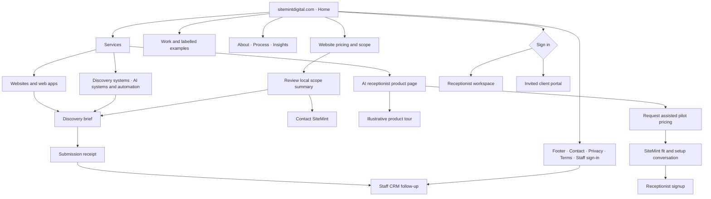
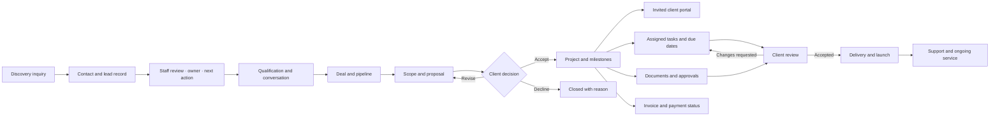
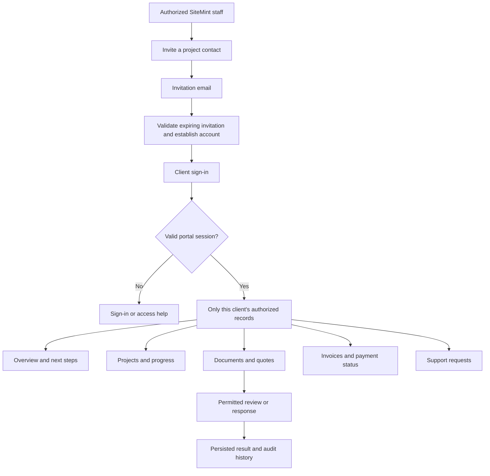
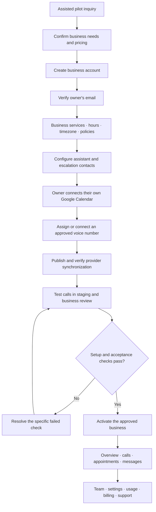
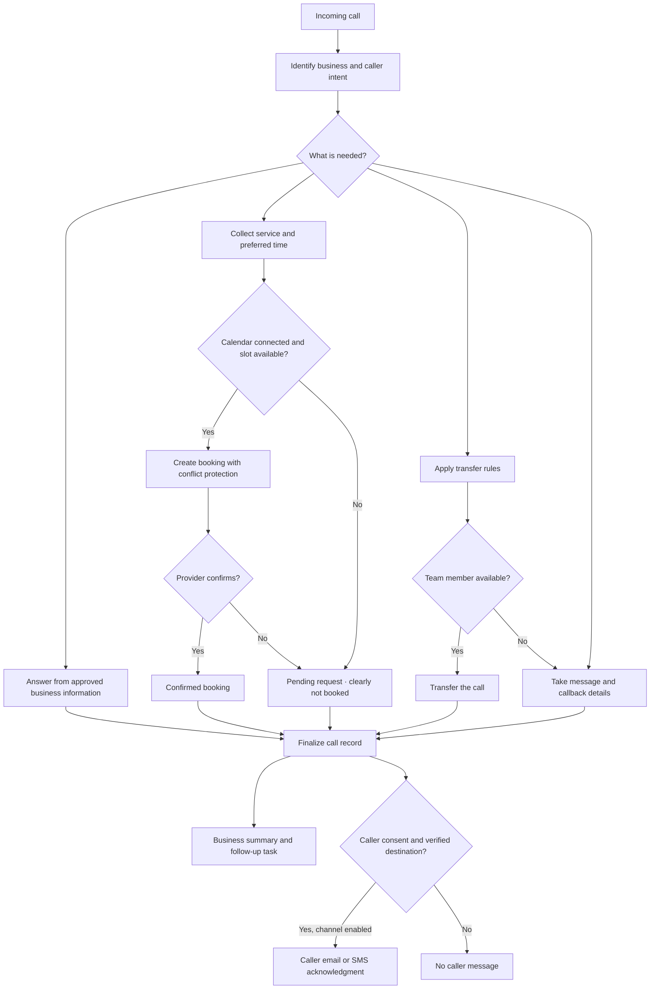
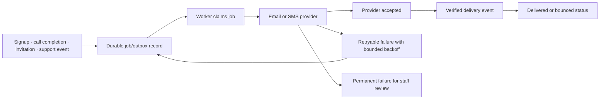
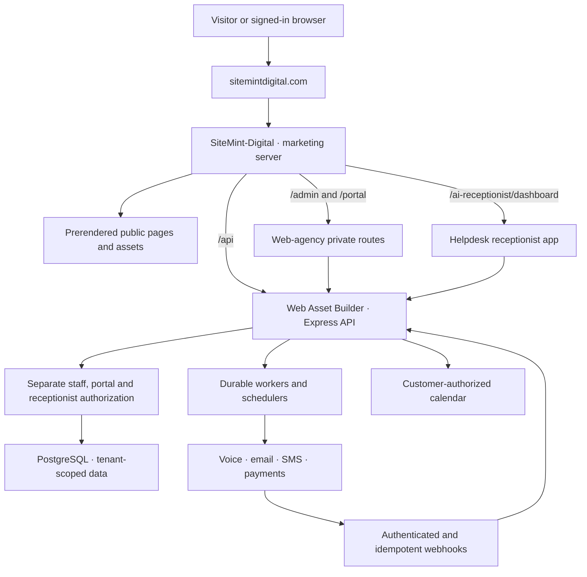

# SiteMint Digital — product and launch workflow

Owner decisions confirmed 2026-09-22: public website and inquiries; assisted AI receptionist pilot; test accounts and records in staging only; Codex is the only active editor. This document defines the product. It does not certify production readiness.

Staff identity decisions confirmed by the owner:

| Person/account | Product role | Existing permission role |
| --- | --- | --- |
| Confirmed business mailbox | SiteMint business owner | `owner` |
| Confirmed personal mailbox | Technical director | `technical_admin` |

These are the intended account assignments, not a claim that accounts have been provisioned or sign-in verified. Use individual staff authentication and the existing role permissions. Do not turn the technical director into a second owner implicitly. Customer receptionist identities, client-portal invitations and customer calendar connections remain separate. No shared business calendar is required for customer onboarding.

Exact account addresses are kept in the owner's local launch notes, outside public release source.

## Launch acceptance checkpoint — 2026-09-23

The agreed flowcharts below remain the target. A page or implemented route is not proof of an accepted end-to-end workflow.

| Journey | Current evidence | Remaining acceptance |
| --- | --- | --- |
| Public discovery | Expanded Mint Clarity source ac5449b is live; major public routes and homepage interactions checked | Trace an authorized inquiry into CRM without contacting unrelated recipients |
| Staff CRM | Owner setup and authenticated settings previously verified | Director provisioning, role boundaries, contact/lead/deal/task/support writes in staging |
| Project client portal | Live sign-in route loads | Invitation, sign-in and per-client document/ticket isolation in staging |
| Receptionist onboarding | Live sign-in route loads; production Google project, client, API, scopes and three test users configured | Production account session, OAuth callback, calendar selection, availability and booking acceptance |
| Call handling | Implemented provider and post-call paths; historical call evidence | Production callback destination, synchronized assistant, authorized new call and durable outcomes |
| Email | Direct provider test accepted; director inbox receipt confirmed | Real CRM application send and post-call delivery, retries and duplicate prevention |
| Subscription/usage | Assisted pilot uses request pricing | Cost/margin review and separately authorized payment acceptance before billing customers |

Launch sequence: public presentation first; prove intake and staff follow-up; connect and verify each pilot business; enable live call handling only after provider acceptance. Google Testing access is limited to approved accounts and does not establish public OAuth verification. Test records remain in staging. Real calls, SMS and payments require their separately agreed test scope.

## 1. Product structure

SiteMint Digital is a digital studio with three offers: websites and web apps, business systems, and an AI receptionist subscription. Visitors should understand the business outcome, inspect examples, and take one useful next step. Mint Clarity remains the visual identity.

There are three distinct signed-in audiences. Business owners manage their receptionist and team. Project clients see their own delivery work in an invitation-only portal. SiteMint staff operate the internal CRM. A common brand does not mean shared permissions or an interchangeable session.

Public route details and component ownership are in `CLAUDE-FRONTEND-HANDOFF.md`. Preserve `/portfolio`, `/contact`, `/automation` and legacy application redirects. Old URLs must not lead visitors into the wrong authentication system.

## 2. Digital services and staff CRM

Core staff features for launch: contacts, companies, lead history, pipeline/deals, assigned tasks, inbox, discovery submissions, projects, documents/proposals, invoices/transactions, support, staff roles and operational status. Use existing implementations. Every important record has an owner, status and next action.

Advanced existing features remain secondary: campaigns/sequences, automation approvals, reporting, imports/deduplication and receptionist operations. Their availability must follow verified integrations and permissions. Do not add a new module merely to make the product appear larger. E-signature, accounting connectors, push notifications and offline writes are not launch promises without specific evidence.

## 3. Client portal

Portal access is granted by invitation. It never grants staff CRM access. A successful HTTP response is insufficient: sign-in must reach the correct application, establish the correct session and survive a full reload. Invoice visibility does not itself prove online payments are operational.

## 4. Receptionist onboarding and daily operation

Calendar distinction: SiteMint owns the OAuth application configuration; each customer grants access to their own Google account and chosen calendar. Company Gmail ownership is not a shared booking calendar. Calendar tokens and all records must be tenant-scoped. Disconnected or expired calendar access yields a clear reconnect action and cannot silently create confirmed bookings.

Transfers, caller SMS and subscription billing are part of the intended product, not automatically launch-verified. Expose them only when their configuration and acceptance checks pass. Never repurpose the intake SMS number as a voice-provider number.

## 5. Messages, billing and reliability

Queue state, provider acceptance and delivery are distinct. Duplicate provider events must not double-send messages or double-create bookings. A missing delivery webhook must appear as unverified delivery, not success. Test environments use a sink or test mode; no real customer messages during staging verification.

Subscription billing is SiteMint charging the business: agreed plan → subscription checkout → verified provider webhook → entitlements → usage meter → invoice/payment status → renewal/cancellation. Failed-payment grace periods and service restrictions must be explicit. No guessed prices, automatic number purchases or live test payments.

## 6. System, routing and deployment

Configuration groups: database identity; session/security settings; exact CORS origins; email sender/delivery mode; voice publish/webhook/artifact policy; customer calendar OAuth and token encryption; SMS credentials and enablement; billing/webhook settings; frontend base paths and capability flags. Inspect presence/format without printing credentials. A frontend build flag cannot substitute for a working backend capability.

Release order: identify source and target → validate config → fresh backup → restore/upgrade rehearsal → schema verification → build correct frontend/backend artifacts → stage smoke test → production release → public-domain acceptance → retain rollback. Preserve applied migration bytes and independent migration journals. Earlier reports conflict on startup migrations; current source runs Stripe migrations at boot, so do not assume it upgrades all product schemas.

## 7. Frontend and SEO standard

- Retain Mint Clarity and short business-oriented explanations. Use actual product screenshots and clearly labelled illustrations. No invented proof.
- Useful interactions: service exploration, receptionist scenario tabs, FAQs, scope summary, setup progress and contextual next actions. Prefer these over adding decorative modules.
- Motion supports state changes; respect reduced motion. Keyboard, touch, visible focus, form labels and error recovery remain required.
- Public pages: prerendered meaningful content, individual titles/descriptions, canonical apex URLs, social metadata, sitemap and valid 404 behavior. Private apps and token pages: noindex and protected access. Robots rules are not access control.
- No ranking or traffic guarantees. Performance checks must include real mobile layouts and image/font loading, not only a score.

## 8. Launch evidence — still required

The public Mint Clarity release is verified live at source `f531741`, packaged as `02421d7`. The backend retry also published successfully; health/readiness return 200, and staff setup, client-portal sign-in and receptionist sign-in render through the public domain. Exact evidence is in `LAUNCH-AUDIT-2026-09-22.md`; the public marker does not identify the API or private applications. The production additive schema upgrade passed after a restore rehearsal. Replit's initial generated migration proposed reversing that upgrade because development was stale; that publish was cancelled. Development was then upgraded and its public columns, constraints and indexes match production. Authenticated journeys remain a separate acceptance requirement: the business owner's password setup is pending with the owner.

To call the site ready: verify public inquiry persistence; staff login/reload/logout and role refusal; invited client access to only their data; receptionist login/setup and tenant refusal; calendar/request distinction; correct worker/error status; real-domain routes/assets. Record exact environment, build, action and observed result. Staging is authorized for test accounts and sample records; production test records are not authorized.

The assisted pilot can open only with transparent capability limits and a working human follow-up path. Do not label the whole platform complete while required access paths or persistence checks fail.
