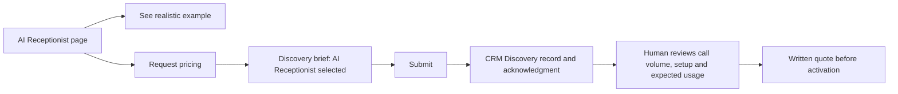
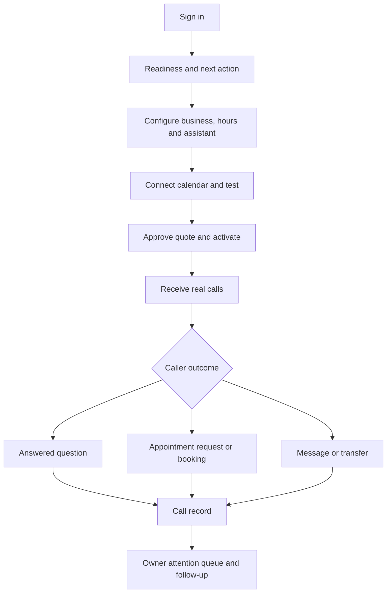

# AI Receptionist: customer journey and design review

This is a review proposal, not a claim that every illustrated feature is active in production. Mint Clarity remains the visual system. The public page should explain a useful outcome quickly; the workspace should show the owner what needs attention before exposing configuration.

## Concept previews

- [Public page concept](./concepts/receptionist-public-concept-2026-09-27.png): editorial call scene plus one clear call-to-outcome sequence. Its sample booking and notification are illustrative. Do not publish the generated image as a product screenshot.
- [Public editorial alternative](./concepts/receptionist-public-editorial-2026-09-27.png): compact split hero and three-step product story. The rendered typography and example call details need rebuilding as real HTML and vetted content.
- [Workspace concept](./concepts/receptionist-workspace-concept-2026-09-27.png): compact navigation, actual readiness, attention queue and appointments. The image invents example data and some actions; production UI must use real state and available permissions.

## Visual direction

Use porcelain (`#F7FAF8`), deep ink (`#153E36`), sea glass (`#DCEEE8`), mineral blue (`#DCE9EB`) and a restrained warm paper tone (`#F5F1EA`). Keep the existing sans typography and dark text. Use mint for status and action, not as a full-page wash. Tighten section spacing, group related information, and use one meaningful call-to-outcome timeline instead of repeated equal-sized cards. Motion should clarify state transitions and respect reduced motion. The existing approved receptionist film can stay in the hero; this review is about the surrounding composition and content.

## Public journey

There is one primary conversion action: **Request pricing**. “See how it works” moves to the example on the same page. Existing customers use a separate sign-in link. Do not add a second pricing interstitial or promise a fixed price.

The quote should state the subscription period and price, included call minutes and texts, any overage rates and caps, setup/integration scope, phone-number charges, recording availability, and what happens when a payment fails. If a price or provider capability is not settled, the page says it is confirmed in the proposal. The discovery brief now asks for approximate monthly calls and the desired after-call outcome when AI Receptionist is selected; a dedicated shorter pricing inquiry remains a later form-design decision.

## Owner workspace journey

The first screen should prioritize actual setup blockers and real follow-up items. Each status needs a direct next action. Keep Calls, Conversations, Appointments, Assistant and Settings discoverable, but group rarely used controls. Do not show fake metrics, disabled capability as active, a replay control when capture is off, or an owner action to staff.

## Verified discovery path for this review

On 2026-09-27, the live `POST /api/discovery/submit` rejected an empty body with HTTP 400 and accepted one clearly labeled internal acceptance submission with HTTP 201 and reference **11**. The route writes `discovery_submissions`, which `/api/crm/discovery-submissions` reads for CRM › Discovery; it also writes `form_submissions` and attempts team/client emails. The authenticated CRM row and email delivery still need a direct visual check. The code changes in this review route receptionist pricing directly to `/discovery?service=ai-receptionist`, preselect the service, clarify where a successful brief goes, and provide a return link. These changes are local until released.
