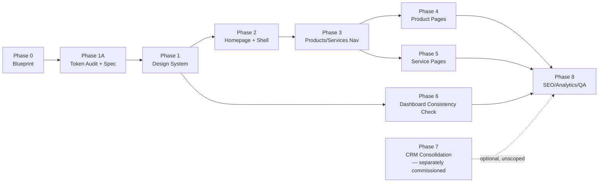

# SiteMint Digital — Platform Implementation Roadmap

> Documentation only — Checkpoint P0, corrected in Checkpoint P0.1. No phase below
> has started. Each phase is a separate future checkpoint requiring its own owner
> approval before work begins, per the task brief's explicit instruction not to
> produce one giant implementation prompt.
>
> **Phase numbering (Blueprint §24 Decision #9/#19, approved)**: this roadmap is
> **Phase 0 through Phase 8 — nine numbered phases** (Phase 0, 1A, 1, 2, 3, 4, 5,
> 6, 7, 8; Phase 1A is a sub-checkpoint inserted between Phase 0 and Phase 1, not
> a tenth top-level number). Any reference elsewhere in these documents to "eight
> phases" means the eight implementation phases that follow Phase 0 (Phase 1
> through Phase 8), not the roadmap's total phase count.
>
> **Next implementation checkpoint (approved, not started)**: after blueprint
> approval, the next checkpoint is **Phase 1A — Design-token audit and shared
> token specification**. It must come before homepage redesign (Phase 2),
> mega-menu implementation (Phase 2/3), application visual restyling (Phase 4/6),
> and CRM shell redesign (Phase 7). **Phase 1A is not implemented in this
> checkpoint (P0.1)** — it is documented here only so a future session does not
> need to reinterpret sequencing.

## Cross-Phase Rules (apply to every phase below)

- One clear objective per phase; stop before unrelated work.
- Touch only the files listed as in-scope for that phase.
- `pnpm run typecheck` clean + relevant artifact build passes before any commit.
- Zero-line `git diff` on every protected file in root `CLAUDE.md` after every phase.
- No console errors on any touched route, light and dark where applicable.
- Each phase produces exactly one reviewable commit; does not auto-push, auto-
  deploy, or auto-merge; stops for owner review before the next phase starts.
- Rollback = revert the single commit; no phase leaves the repo in a half-migrated
  state (old route/component stays until the new one is verified, per Blueprint
  §21 expansion rule #... and the preservation principle in §22).

---

## Phase 0 — Audit and Blueprint Approval

- **Goal**: this checkpoint. Produce the five planning documents; get owner
  sign-off on open decisions (Blueprint §24) before Phase 1 starts.
- **Scope**: `docs/sitemint-platform/**` only.
- **Files/modules affected**: none application-side.
- **Dependencies**: none.
- **Risks**: none — no code changes.
- **Acceptance tests**: five documents exist, `git diff` shows only
  `docs/sitemint-platform/**`, working tree clean afterward.
- **Visual/accessibility/performance tests**: not applicable.
- **Database impact**: none. **Deployment impact**: none.
- **Estimated effort**: small.
- **Stop conditions**: any owner decision in Blueprint §24 still open blocks
  Phase 1 from starting on the affected area (e.g. color palette must be decided
  before Phase 1 token work begins).
- **Rollback**: revert the single P0 commit.

## Phase 1A — Design-Token Audit and Shared Token Specification

> **Not implemented in this checkpoint.** Documented here as the approved next
> implementation checkpoint (Blueprint §24 Decision #9/#19) so it does not need
> to be re-derived or re-approved from scratch by a future session.

- **Goal**: audit helpdesk's existing evergreen/mint tokens against the
  accessibility/contrast/visual-quality bar required for platform-wide adoption
  (per Design doc's "Foundation, Not Final" note), and produce a written shared
  token specification — the single source of truth Phase 1 implements against.
  This phase produces a **specification document**, not CSS changes.
- **Scope**: a new specification artifact only (e.g.
  `docs/sitemint-platform/design-tokens-reference.md`, or equivalent — exact
  location is this phase's own judgment call). No application file is touched.
- **Dependencies**: Blueprint §24 Decision #6/#14 (helpdesk tokens approved as
  starting foundation) — already satisfied as of Checkpoint P0.1.
- **Risks**: none — documentation/specification only, no application code touched.
- **Acceptance tests**: specification document exists; every token has a
  contrast-verified value for both light and dark where applicable; marketing-vs-
  dashboard density rules (Design doc §41) are captured explicitly, not left
  implicit.
- **Visual tests**: not applicable (no rendered surface changes in this phase).
- **Accessibility tests**: contrast ratios computed and recorded for every core
  neutral, semantic, and accent token pairing that will be reused platform-wide.
- **Performance tests**: not applicable.
- **Database impact**: none. **Deployment impact**: none.
- **Estimated effort**: small.
- **Stop conditions**: if any existing helpdesk token fails AA contrast under
  audit, the specification must record a revised value rather than carrying the
  failure forward into Phase 1 — this phase is the gate that prevents an
  inaccessible token from becoming "final" by default.
- **Rollback**: N/A — no code changes; a revised specification simply supersedes
  the prior draft.
- **Must precede**: homepage redesign (Phase 2), mega-menu implementation
  (Phase 2/3), application visual restyling (Phase 4/6), and CRM shell redesign
  (Phase 7) — binding sequencing rule, not a soft suggestion.

## Phase 1 — Shared SiteMint Design System

- **Goal**: implement the token system from `DESIGN_SYSTEM_DIRECTION.md` as the
  platform standard, per the Phase 1A specification, starting with formalizing
  helpdesk's existing (now audited) tokens as the canonical source and bringing
  `web-agency` onto the same neutral/semantic layer.
- **Scope**: `artifacts/web-agency/src/index.css` (token values only — no
  component rewrites yet), optionally a new shared reference (e.g.
  `docs/sitemint-platform/design-tokens-reference.md` or a future `lib/`
  package — package extraction is a judgment call for the phase's own planning,
  not decided here).
- **Dependencies**: Phase 1A complete (token specification approved). The
  underlying palette-foundation decision (Blueprint §24 Decision #6/#14) is
  already resolved as of Checkpoint P0.1 — Phase 1A's audit refines it, it does
  not re-litigate it.
- **Risks**: `web-agency`'s existing blue-branded pages will look visually
  "unfinished" until Phase 2 re-themes components — this phase changes tokens,
  not yet every component's usage of them; must be scoped and communicated as such.
- **Acceptance tests**: `web-agency` typecheck + build pass; helpdesk untouched
  (zero diff); no visual regression on components not yet migrated (they may look
  stale, not broken).
- **Visual tests**: side-by-side screenshot of new token values applied to a
  neutral test page.
- **Accessibility tests**: contrast-check new neutral/semantic tokens against
  both current `web-agency` component set and helpdesk's existing usage.
- **Performance tests**: font-loading unchanged (same font families already
  used); no new blocking requests.
- **Database impact**: none. **Deployment impact**: none (frontend-only, both
  apps unaffected functionally).
- **Estimated effort**: medium.
- **Stop conditions**: if contrast testing fails AA on any adopted token,
  halt and revise before proceeding to Phase 2.
- **Rollback**: revert token file changes; components keep working since Tailwind
  falls back to old values until re-themed.

## Phase 2 — Main Homepage and Global Shell

- **Goal**: redesign `Home.tsx`, `Navbar.tsx`, `Footer.tsx` using Phase 1 tokens
  and the homepage narrative below.
- **Scope**: `artifacts/web-agency/src/pages/Home.tsx`,
  `artifacts/web-agency/src/components/layout/{Navbar,Footer}.tsx`.
- **Dependencies**: Phase 1 complete.
- **Risks**: Navbar/Footer are used on every public page — a regression here is
  the highest-blast-radius single change in this whole program; requires the
  most thorough manual click-through of every public route afterward.
- **Acceptance tests**: every existing public route still renders correctly
  under the new Navbar/Footer; all existing nav links still resolve.
- **Visual tests**: desktop + mobile, light mode (dark mode not required for
  `web-agency` in MVP per PRD §34) screenshots of homepage and one other public
  page under the new shell.
- **Accessibility tests**: keyboard nav through new nav/footer, focus rings
  visible, `aria-current` on active nav item.
- **Performance tests**: homepage load time not regressed by any new motion
  (per Design doc motion budget).
- **Database impact**: none. **Deployment impact**: none.
- **Estimated effort**: large.
- **Stop conditions**: the MVP nav set (Route doc §14, Blueprint §24 Decision
  #4/#13) is already approved as of Checkpoint P0.1 — this phase does not stop on
  that dependency. It does stop if Phase 1A/Phase 1 tokens are not yet complete.
- **Rollback**: revert the phase commit; old Home/Navbar/Footer restored exactly.

## Phase 3 — Products/Services Navigation and Overview Pages

- **Goal**: build `/products/` and `/services/` overview pages and wire them into
  the Phase 2 nav.
- **Scope**: two new page files + route registration in `App.tsx`; no changes to
  any existing route.
- **Dependencies**: Phase 2 complete. AI Toolkit inclusion is already approved
  (Blueprint §24 Decision #2) — this phase does not wait on that decision.
- **Risks**: low — purely additive routes.
- **Acceptance tests**: both pages render, both reachable from nav, both list
  only real (non-fabricated) products/services.
- **Visual/accessibility/performance tests**: same battery as Phase 2, scoped to
  the two new pages.
- **Database impact**: none. **Deployment impact**: none.
- **Estimated effort**: medium.
- **Stop conditions**: none beyond the standing dependency.
- **Rollback**: remove the two new routes/files; no existing route affected.

## Phase 4 — Individual Product Landing Pages

- **Goal**: retokenize the existing `/ai-receptionist` page to the shared design
  system; build the new `/products/ai-toolkit` page (if approved in Phase 0/3).
- **Scope**: `artifacts/web-agency/src/pages/LandingReceptionist.tsx` (retokenize
  only, preserve all existing sections/copy structure), one new AI Toolkit
  marketing page.
- **Dependencies**: Phase 3 complete.
- **Risks**: `LandingReceptionist.tsx` is a long, section-heavy file — retokenizing
  without behavior change requires care around its interactive demo section.
- **Acceptance tests**: signup flow (`/ai-receptionist/signup`) untouched and
  still functional end-to-end; all anchor links (`#demo`, `#features`, etc.)
  still resolve.
- **Visual/accessibility/performance tests**: full page screenshot battery,
  desktop + mobile.
- **Database impact**: none. **Deployment impact**: none.
- **Estimated effort**: large.
- **Stop conditions**: any change to the signup form's submission behavior is
  out of scope — if retokenizing requires touching that logic, stop and split
  into a separate reviewed change.
- **Rollback**: revert the phase commit.

## Phase 5 — Individual Service Pages

- **Goal**: build six service pages (or sections within `/services/`, decided
  during phase planning) with real, non-fabricated copy.
- **Scope**: new page files under `artifacts/web-agency/src/pages/services/` (or
  equivalent), route registration only.
- **Dependencies**: Phase 3 complete.
- **Risks**: low — additive only.
- **Acceptance tests**: each service page reachable, each has a working
  Discovery CTA.
- **Database impact**: none. **Deployment impact**: none.
- **Estimated effort**: medium.
- **Stop conditions**: none.
- **Rollback**: remove new routes/files.

## Phase 6 — Customer Application Visual Consistency

- **Goal**: verify/adjust helpdesk's existing design system against the now-
  shared platform tokens (helpdesk is already the *source* of the shared tokens
  per Phase 1, so this phase is mostly verification, not rebuild).
- **Scope**: spot-check only; changes limited to any drift found, not a redesign.
- **Dependencies**: Phase 1 complete.
- **Risks**: helpdesk's backend/SMS locks (root `CLAUDE.md`) remain absolute —
  this phase is UI-only and must re-verify zero-diff on every protected file,
  exactly as every prior helpdesk UI phase has (see `SESSION_HANDOFF.md`
  precedent).
- **Acceptance tests**: helpdesk typecheck + build pass; protected-file diff = 0.
- **Database impact**: none. **Deployment impact**: none.
- **Estimated effort**: small.
- **Stop conditions**: any drift requiring more than a token/class tweak gets
  split into its own separately-scoped follow-up, not absorbed into this phase.
- **Rollback**: revert the phase commit.

## Phase 7 — SiteMint Internal Admin and CRM Consolidation

- **Goal**: address the genuine CRM gaps flagged in
  `ROUTE_AND_NAVIGATION_ARCHITECTURE.md` (standalone `clients`/`proposals` views,
  `support`, `content`, `portfolio`-as-CRM-content) — **only if and when the
  owner separately commissions this work**; this phase is a placeholder pointer,
  not a committed scope.
- **Binding constraint (Blueprint §24 Decision #5/#16, approved)**: existing CRM
  routes are not reorganized, renamed, or removed as part of the main public
  website redesign or shared design-system work (Phases 1A–6). If this phase is
  ever pursued, it **begins with an admin information architecture and shell
  review**, not with route renames — and any actual route migration, alias, or
  redirect requires its own separately approved checkpoint beyond even this
  Phase 7 placeholder.
- **Scope**: TBD in its own future PRD; explicitly not defined here per the "no
  large feature-list bundling" instruction in the source brief.
- **Dependencies**: a dedicated owner commission and its own CRM-specific PRD —
  this is not implied or unlocked by any decision resolved in Checkpoint P0.1.
- **Risks**: highest of any phase — touches locked-adjacent, revenue-critical CRM
  surface (`ARCHITECTURE.md` DEVELOPMENT_RULES.md change-budget and locked-engine
  rules apply in full); existing CRM data and workflows must remain protected
  throughout, if this phase is ever pursued at all.
- **Acceptance tests**: TBD per its own PRD.
- **Database impact**: TBD — likely additive-only if any (per root CRM push-mode
  convention). **Deployment impact**: TBD.
- **Estimated effort**: very large (if pursued at all).
- **Stop conditions**: do not begin without a dedicated PRD and explicit owner
  go-ahead — this phase is intentionally the least-specified in this roadmap.
- **Rollback**: N/A until scoped.

## Phase 8 — SEO, Accessibility, Performance, Analytics, and Release QA

- **Goal**: close the SEO gap (per-route titles/meta, structured data), select
  and install an analytics vendor with the event list from the PRD (§24), and run
  a full accessibility/performance pass across every touched page from Phases 1–6.
- **Scope**: `index.html`/per-route meta handling in `web-agency` (and `ai-
  toolkit` if it's been integrated by Phase 4), one new analytics dependency +
  its initialization code.
- **Dependencies**: owner analytics-vendor decision (Blueprint §24 Decision #3 —
  deliberately deferred to this phase, not resolved earlier); all prior phases
  complete.
- **Risks**: analytics script must not become render-blocking or introduce a
  new third-party security surface without review (PRD §28).
- **Acceptance tests**: unique `<title>`/meta per route verified; sitemap.xml
  includes only indexable routes; `noindex` confirmed on all admin/dashboard
  routes; core events firing (verified via vendor's debug tooling, not by
  fabricated numbers).
- **Visual tests**: none new. **Accessibility tests**: full AA contrast +
  keyboard-nav sweep across every route touched since Phase 1. **Performance
  tests**: Lighthouse pass on homepage and one product page, compared against a
  Phase-0 baseline captured at the start of this phase (no baseline exists yet —
  capturing one is part of this phase's own acceptance criteria).
- **Database impact**: none. **Deployment impact**: this phase is the release-
  readiness gate; still does not itself deploy — deployment remains a separate,
  explicitly-approved action per the standing "never deploy without approval" rule.
- **Estimated effort**: large.
- **Stop conditions**: no phase after this one is currently planned — Phase 8 is
  the closing QA gate for this roadmap's MVP scope (PRD's MVP Platform Scope).
- **Rollback**: revert the phase commit; analytics can be disabled via its own
  config flag without a code revert if issues surface post-launch.

---

## Sequencing Summary



Nine numbered phases total — Phase 0 through Phase 8 (0, 1, 2, 3, 4, 5, 6,
7 [optional/unscoped], 8) — plus one inserted sub-checkpoint, Phase 1A, sitting
between Phase 0 and Phase 1. Phase 1A is the next implementation checkpoint after
this documentation program — not started, not implemented in Checkpoint P0.1.

Each arrow is a hard dependency and a stop point: no phase begins before its
predecessor is reviewed, committed, and (if the owner chooses) pushed as a branch
backup — mirroring the precedent already set by the voice-platform program's
B1→B2→B3 sequencing in `docs/ai-receptionist/VOICE_PLATFORM_UI_UX.md` §16.

---

## Checkpoint 2A — Feature-Flagged Global Shell and Homepage Preview (implemented)

> Distinct from roadmap **Phase 2** above (which redesigns the live
> `Home.tsx`/`Navbar.tsx`/`Footer.tsx`). Checkpoint 2A is a **feature-flagged,
> non-live visual prototype** validating the shell/homepage direction before
> Phase 2 touches any production route — it does not replace or unblock Phase 2's
> own dependency on Phase 1 (shared design system in `web-agency/src/index.css`).

- **Route**: `/platform-preview` (`artifacts/web-agency/src/pages/PlatformPreview.tsx`),
  lazy-loaded, registered in `App.tsx` outside the main `<Layout>` (own navbar/
  footer/theme, per `components/platform-preview/*`).
- **Feature flag**: `VITE_SITEMINT_PLATFORM_PREVIEW_ENABLED` (`src/lib/platformPreviewFlag.ts`),
  default false/fail-closed. When false or unset, the route renders the app's
  ordinary `NotFound` page — no redirect, no prototype markup ships.
- **Preview status**: internal, unpublished. `noindex, nofollow` set at
  runtime for this route only (`document.title`/meta patched on mount, restored
  on unmount); never in `sitemap.xml`, never linked from the current public
  Navbar/Footer, robots allowlist, or CRM.
- **Design tokens**: consumes `@workspace/design-tokens` (Phase 1B/1B.1/1C.1
  tokens) directly via `--sm-*` custom properties, scoped to prototype
  components only — `web-agency`'s existing `--color-*`/`--primary`/etc. theme
  (its current blue identity) is untouched; no existing page re-themed.
- **Theme**: prototype-local light/dark toggle (`usePlatformPreviewTheme.ts`),
  namespaced `sitemint-platform-preview-theme` localStorage key, `.dark` class
  scoped to the prototype's own root element only — documented as transitional
  per `SHARED_DESIGN_TOKENS_SPEC.md`'s "Theme Strategy," not a platform-wide
  theme provider.
- **Bundle isolation**: `PlatformPreview` and `platform-preview.css` ship as
  their own lazy chunk; measured production build showed the shared/ordinary
  entry bundle essentially unchanged (+1.69 kB JS, 0 kB CSS) with the prototype
  isolated in its own ~37 kB JS / ~10 kB CSS chunk.
- **Known placeholder/owner-review items**: AI Toolkit product card CTA is a
  non-navigating "Coming to sitemintdigital.com" state (no `/products/ai-toolkit`
  route exists yet — Phase 4 territory); Services card CTAs all point at the
  existing `/services` overview (no per-service routes exist yet — Phase 5
  territory); Connected Workflow section is explicitly labeled as direction/mix
  of already-live and future capability, not a claim that every step is live
  today; Selected Work reuses the same three real projects already in
  `Portfolio.tsx` (no fabricated results).
- **Activation is not approved.** This checkpoint ships the prototype behind
  the flag only — turning the flag on anywhere outside local/private preview,
  linking the route publicly, or promoting it to a live route are separate,
  future, explicitly-approved actions (Phase 2+).

---

## Checkpoint 2A.1 — AI-Native Positioning, Capability Labeling, Future Direction (implemented)

> Extends Checkpoint 2A on the same route/flag; no new route, no auth change,
> no real AI calls, no SSO/portal build. Documentation additions below are
> **direction statements**, not commitments with a scheduled phase number —
> they still require their own future-approved checkpoint before any is built.

- **Signature interaction**: `/platform-preview`'s "What's your priority right
  now?" business-goal selector (`BusinessGoalSelector.tsx`) is data-driven
  (`businessGoals.ts`) and coordinates hero-adjacent copy, ecosystem/workflow
  stage emphasis (`systemFlow.ts`, shared by both `EcosystemVisual.tsx` and
  `ConnectedWorkflowSection.tsx` — one data source, two compositions, no
  per-goal duplicated layout), recommended product/service badges, and a
  contextual CTA. Session-only React state — no localStorage, cookie, or
  cross-session persistence of the selection; a visible microcopy line
  states this explicitly next to the control.
- **Honest capability labeling** (`capabilityStatus.ts`, `CapabilityBadge.tsx`):
  every system-flow stage and product carries one of four labels —
  Available now / In development / Planned direction / Conceptual
  demonstration — using the design-tokens' already-corrected
  `statusbadge-*` tokens. Labels are grounded in the actual repo state
  (e.g. the "Visible to the team" / Analytics stage is labeled **planned**
  because no analytics tool is installed anywhere in the repo today —
  `DESIGN_TOKEN_AUDIT.md` §21, PRD §24 — not because of a stylistic choice).
- **AI-native operating model — documented direction, not built**: future
  SiteMint AI product actions are intended to follow **Understand → Recommend
  → Use an approved tool → Ask for confirmation when required → Complete the
  action → Record the outcome → Keep the business informed**, preserving
  human escalation, permission boundaries, auditability, structured data,
  tenant isolation, input validation, cost controls, explicit uncertainty
  handling, and provider independence throughout. The prototype illustrates
  this only through the capability-labeled system-flow narrative above — it
  performs no real AI action, calls no model, and makes no autonomous-agent
  claim. Any implementation is a future, separately-scoped checkpoint.
- **SEO & AI Search Visibility — recorded as a future strategic service
  direction**, not implemented this checkpoint. Direction: important claims
  stay as readable HTML text (never hidden/keyword-stuffed blocks), descriptive
  headings, internally linked product/service/solution pages, visible company
  and contact information, structured data only where it matches visible
  content, no fabricated authorship/expertise claims, and no promise of
  guaranteed inclusion in any AI-assisted answer surface. Current `web-agency`
  SEO (static per-app title/meta, `sitemap.xml`/`robots.txt`) is unchanged —
  this remains Roadmap Phase 8 scope.
- **Future account strategy — documented direction, not built.** Phase 2A.1
  does not implement unified customer authentication:
  ```
  sitemintdigital.com   → public company/marketing experience
  SiteMint Account      → future unified customer identity + product launcher
  AI Receptionist       → customer product (own auth, unchanged)
  AI Toolkit            → customer product when a logged-in area exists
  Service Client Portal → projects/files/billing/support, when built
  Private Admin         → separate SiteMint staff identity (unchanged)
  ```
  Consistent with `PRODUCT_REQUIREMENTS_DOCUMENT.md` §18: any future shared
  customer identity (with optional org workspaces/roles/SSO/passkeys) is a
  distinct, dedicated security initiative with its own PRD, and must never
  imply internal CRM/admin access.
- **Performance design targets** (not measured/claimed this checkpoint — no
  Lighthouse run occurred): LCP ≤ 2.5s, INP ≤ 200ms, CLS ≤ 0.1 as the
  production bar this prototype is designed toward. Consistent with that bar:
  no WebGL/canvas library, no autoplaying video, no oversized hero assets, one
  bounded `setInterval` cycle (the living-system demo, cleared on unmount and
  paused on hover/focus/reduced-motion), and every goal variation renders from
  the same DOM (conditional content swap, never all variants mounted at once).
- **Accessibility target**: WCAG 2.2 AA, not claimed as formally audited.
  Existing Phase 2A keyboard/focus/reduced-motion verification extends to the
  new goal-selector radiogroup (arrow-key roving tabindex, `aria-checked`,
  `aria-live="polite"` result region) and capability badges (text-based
  labels, not color-only meaning).
- **Privacy**: goal selection is an explicit, visible, session-only choice —
  no covert inference, fingerprinting, or cross-session tracking; no
  advertising tracker is introduced this checkpoint.

---

## Checkpoint 2A.2 — Complete Access Strategy, Connected Comparison, Product Demos (implemented)

> Extends Checkpoint 2A/2A.1 on the same route/flag. No new route, no unified
> auth, no SSO, no customer portal, no real AI/provider call.

- **Sign In strategy**: "Client Login" is removed from the prototype
  (desktop nav, mobile menu, footer) and replaced with **Sign In**, a direct
  secondary-hierarchy link — not a dropdown, since exactly one customer
  product has a real login today. Destination is
  `/ai-receptionist/dashboard/login` (`navConfig.ts`'s `signInHref`),
  verified against `artifacts/helpdesk/src/App.tsx`'s registered `/login`
  route and matching the existing link in `LandingReceptionistSignup.tsx`.
  Never `/admin`, never a legacy route. A code comment on `signInHref`
  records that Sign In should become a small product-access menu once a
  second real customer-product login exists — not before.
- **Only AI Receptionist is exposed as customer product access** in this
  checkpoint. AI Toolkit has no login/account of any kind
  (`artifacts/ai-toolkit/src/App.tsx` registers only `/`, `/thank-you`,
  `/cancel`) and gets no Sign In or Launch App affordance anywhere in the
  prototype — only a non-link "Explore the product direction" state.
- **Future SiteMint Account direction** — documented, not built (see
  Checkpoint 2A.1's future-account-strategy entry above; unchanged this
  checkpoint, Sign In's code comment cross-references it).
- **Connected/Disconnected interaction**: a real accessible segmented
  control (`ConnectedModeToggle.tsx`, radiogroup, keyboard-operable, no
  hover-only behavior) shared via `PlatformPreviewGoalContext`'s new
  `systemMode` state — rendered once, in `EcosystemVisual`, and read (not
  re-rendered) by `SiteMintDifferenceSection`, so the two sections never show
  two competing toggles for the same comparison. Disconnected-state
  narrative lives in `systemFlow.ts` (`disconnectedNote`/`disconnectedState`
  per stage) — one data source, not a duplicated second diagram. Capability
  badges are shown only in connected mode, since they describe what
  SiteMint's system does; showing them next to the disconnected narrative
  would read as contradictory.
- **Demonstration labeling**: the AI Receptionist mini-demo
  (`AiReceptionistDemo.tsx`) is explicitly labeled "Interactive
  demonstration — example customer journey," uses only fabricated example
  data (never real customer information), and separately labels SMS intake
  (available now), voice (in development), and automated CRM follow-up
  (conceptual demonstration) rather than implying one uniform capability
  level. It updates via the existing goal-selection interaction
  (`businessGoals.ts`'s new `demoScenarioId` field mapping to
  `receptionistDemoScenarios.ts`) rather than introducing a second,
  competing selector.
- **AI Toolkit development status**: corrected from Checkpoint 2A.1's
  "available" framing (which conflated "the app is deployed" with "it's a
  ready customer product") to **"In development"** — the honest status per
  this checkpoint's explicit instruction, since AI Toolkit has no customer
  auth. `AiToolkitPreview.tsx` replaces the earlier decorative note with a
  labeled panel of conceptual (not shipped) capability directions and no
  Sign In/Launch CTA.
- **Process section**: relabeled Discover → **Architect** → Build → Launch →
  Improve (was Discover/Design/Build/Launch/Improve), rebuilt as an
  interactive milestone rail (`ProcessSection.tsx`) using the same
  accessible radiogroup pattern as the goal selector — each phase's artifact
  is always visible without interaction; selecting a phase reveals its
  fuller detail. No fake project-status, timeline, or delivery-date data.
- **Difference section**: rebuilt as a three-part composition
  (`SiteMintDifferenceSection.tsx`) — fragmented operation / customer
  journey boundary / SiteMint connected system — reading the shared
  `systemMode` instead of rendering its own toggle.
- **Motion discipline**: the living-system auto-cycle (`EcosystemVisual.tsx`)
  now also pauses via `document.visibilityState` (tab hidden) and an
  `IntersectionObserver` (scrolled out of view), in addition to the existing
  hover/focus/reduced-motion/disconnected-mode pauses — verified via a
  simulated `visibilitychange` event.
- **Badge discipline**: capability badges were removed from
  `ConnectedWorkflowSection`'s per-item rendering (kept only in
  `EcosystemVisual` and `ProductsSection`) to avoid the "excessive status
  badges" anti-pattern, since the workflow section's prose already states
  the same capability honestly.
- **Activation is not approved.** Same standing note as Checkpoint 2A/2A.1.

---

## Checkpoint 2A.3 — Clarify Product Readiness and Owner Review (implemented)

> Copy, capability-governance, and visual-review checkpoint only — no new
> route, no redesign, no new product functionality. Same route/flag as prior
> checkpoints.

- **Final Sign In strategy**: label stays "Sign In" (concise, visible);
  destination stays `/ai-receptionist/dashboard/login` (unchanged,
  re-verified); all three instances (desktop nav, mobile menu, footer) now
  carry `aria-label="Sign in to AI Receptionist"` for a precise accessible
  name without lengthening the visible label. `navConfig.ts`'s existing
  comment (from Checkpoint 2A.2) already documents that Sign In becomes a
  product-access menu only once a second real customer-product login
  exists — unchanged, reaffirmed.
- **AI Receptionist readiness hierarchy**: `ProductsSection.tsx` no longer
  shows one blanket "Available now" badge for the whole product. It now
  shows a three-line breakdown (`receptionistReadiness`): SMS receptionist
  — Available now; Voice experience — In development; Connected CRM &
  follow-up — Planned direction. The interactive demo
  (`AiReceptionistDemo.tsx`) no longer repeats this breakdown (avoids
  duplicate badges in the same card) and instead carries one explicit
  disclosure line: "Synthetic example, not a live conversation — no real
  call, provider connection, or customer record."
- **AI Toolkit product-preview status**: unified on one readiness word,
  "In development," everywhere it appears — `navConfig.ts`'s dropdown note
  (was "Coming to sitemintdigital.com," which read as a scheduling promise
  next to the "In development" badge elsewhere), `ProductsSection.tsx`'s
  card badge, and `AiToolkitPreview.tsx`'s panel heading (was "conceptual
  direction," now "product preview" — naming what the panel *is* rather
  than adding a second readiness word next to the badge). No Sign In,
  Launch, or "Available now" label anywhere for AI Toolkit.
- **Capability-evidence review**: completed this checkpoint against the
  actual repository (root `CLAUDE.md` protected-file list, `lib/db/src`
  schema, `artifacts/ai-toolkit/src/App.tsx`'s route registration, and this
  repo's CRM route inventory) — full matrix recorded in the Checkpoint 2A.3
  session report, not duplicated here. Headline correction: "CRM storage"
  (the CRM itself, real and extensive) and "CRM integration" (an automatic
  hand-off from AI Receptionist conversations into the CRM pipeline) are
  now treated as two distinct capabilities — no evidence of the latter
  (no foreign key or sync path from `intake_*` tables into `crm_leads`/
  `crm_deals`; `/admin/crm/intake-cases` is a dedicated staff view, not a
  merged pipeline), so it stays labeled "Planned direction," not
  "Available now."
- **No SiteMint Account yet.** No client portal yet. Both remain documented
  direction only (Checkpoint 2A.1's future-account-strategy entry, above),
  never implemented, never linked from the prototype.
- **Activation is not approved.** Same standing note as every prior
  checkpoint in this program.

---

## Checkpoint 2A.4 — Premium Visual Art Direction and Signature Product Experience (implemented)

> Visual/art-direction refinement only, following an owner review of the
> Checkpoint 2A.3 screenshot package. Same architecture, interaction logic,
> route, and flag as prior checkpoints — no new business logic, no strategy
> expansion.

- **Signature hero**: rebuilt as a two-column composition
  (`PlatformHero.tsx`) — headline/CTA/goal-selector on the left, a new
  `HeroSystemCanvas.tsx` living-system diagram on the right (five-node
  inquiry path, driven by the same `selectedGoal.emphasizedStageIds` data
  the rest of the page already reads). Restrained architectural grid +
  two radial glows in the background; one non-looping draw-in animation
  only. No gradient blobs, no WebGL/Three.js, no video, no cursor gimmicks.
  `BusinessGoalSelector.tsx` moved from a standalone section into a compact
  panel embedded in the hero's left column.
- **Hero CTA hierarchy**: primary CTA is now "Build Your SiteMint System"
  (→ `/discovery`); secondary is "Explore How It Works" (in-page anchor to
  the ecosystem section). Nav's "Start a Project" and "Sign In" unchanged.
- **Goal-selection screenshot defect fixed**: the Checkpoint 2A.3 owner
  review flagged that `02-desktop-hero-never-miss-call.png` was
  byte-identical to the default goal state (a capture-script no-op, not an
  actual design issue). The Phase 2A.4 review package captures all four
  goal states with content-verified, uniquely-hashed screenshots
  (`01`–`04`) — confirmed genuinely distinct via MD5 and via the
  goal-selector's own visible supporting copy.
- **Product section rebalance**: `ProductsSection.tsx` grid changed to an
  asymmetric `lg:grid-cols-3` layout (AI Receptionist spans 2 columns, AI
  Toolkit spans 1) instead of two equal-width cards; AI Toolkit's
  description was extended so its card isn't visually empty next to
  Receptionist's richer content. `AiToolkitPreview.tsx`'s capability icons
  now sit in mint-tinted circular chips instead of flat unstyled icons.
- **Services bento layout**: `ServicesSection.tsx` replaced the uniform
  6-card grid with two tiers — two larger "featured" cards (Websites, CRM
  Systems, with problem/approach/deliverable) and four smaller "compact"
  cards (problem statement only), instead of six visually identical cards.
- **Connected-journey visual continuity**: `EcosystemVisual.tsx` gained a
  decorative connecting line across its stage row and replaced the
  per-stage `CapabilityBadge` with a lighter inline dot+label (reduces
  badge density per the reviewer's note).
- **Difference section rebuilt as a system-boundary flow**:
  `SiteMintDifferenceSection.tsx` replaced the 3-column comparison grid
  with a single linear vertical flow (`boundarySteps`) showing one inquiry
  moving through either path, with a connected/disconnected-aware closing
  line, instead of a conventional SaaS comparison table.
- **Selected Work**: `SelectedWorkSection.tsx` now presents each real
  project inside a browser-chrome frame (dot controls + domain pill) to
  visually signal "real external site." Real screenshot capture of the
  three live project domains was attempted and confirmed unavailable in
  this environment (outbound requests to all three return a 403 from the
  environment's proxy) — documented in the component's code comment rather
  than fabricating page imagery, which the task's honesty constraints
  prohibit.
- **Process section artifacts**: `ProcessSection.tsx`'s detail panel now has
  an artifact-style header bar (icon + "{phase} artifact — {artifact
  type}") above the existing description, giving each phase a distinct
  visual deliverable identity instead of one flat paragraph.
- **Final CTA / dark-theme fix**: `FinalCtaSection.tsx` no longer uses
  `--sm-color-bg-inverse` (which flips to near-white in dark theme,
  producing a stark white card against a dark page). It now uses a fixed
  deep evergreen-charcoal gradient with fixed light text in both themes.
  `ConnectedWorkflowSection.tsx`'s emphasized-row background was changed
  from a light-theme-only mint primitive (read as a disabled gray row in
  dark theme) to a theme-aware primary-action tint.
- **Footer**: `PlatformPreviewFooter.tsx` gained a bolder brand statement
  line above the existing muted paragraph, and the muted paragraph was
  reworded to state the "one connected technology company" positioning
  more directly.
- **Verification**: whole-workspace typecheck clean; web-agency production
  build clean (ordinary entry bundle unchanged at ~2,016 kB JS / ~199 kB
  CSS; preview lazy chunk 65.33 kB JS / 10.29 kB CSS, isolated from the
  ordinary bundle); shared design-token/accessibility test suite passing;
  zero horizontal overflow at 320/375/768/1024/1280/1440px in both themes;
  keyboard focus confirmed visible; flag-off homepage and `/platform-preview`
  re-confirmed unchanged/404 respectively; zero-line diff on every
  CLAUDE.md-protected file; frozen-lockfile install clean.
- **Activation is not approved.** Same standing note as every prior
  checkpoint in this program.

## Checkpoint 2B.2 — Portfolio Permissions, Asset Validation, Mobile Captures, and Image Optimization (implemented)

> Documentation- and asset-only checkpoint. `SelectedWorkSection.tsx` was
> **not** modified. Full detail in `PORTFOLIO_ASSET_MANIFEST.md` and
> `PORTFOLIO_PERMISSION_MANIFEST.md`.

- Optimized the three approved-candidate desktop screenshots already present
  in the repo (Shasta Greene, OneFilAm Community, Herlinda Valdovinos) into
  WebP under `artifacts/web-agency/public/portfolio/`, all under 300 KB.
  Shasta Greene's source was cropped to remove a third-party feedback-widget
  overlay; the original source PNG was left unmodified.
- Claidy Taguran Portfolio was deliberately **not** optimized or added to the
  approved set — it remains deferred pending URL and relationship
  confirmation.
- Outbound network access to all four project domains was blocked by
  environment policy this session (403 at the proxy), consistent with the
  Phase 2A.4/2B.1 finding for the same domains. No live-site re-verification
  and no new screenshot capture (desktop or mobile) was possible; this is
  reported directly rather than worked around. Mobile screenshots do not
  exist for any project and remain the primary open gap.
- No project has permission-approved or implementation-approved status yet;
  see the permission manifest for per-project approval requirements.

## Checkpoint 2B.3 — Data-Driven Selected Work Experience (implemented)

> Implements the real portfolio visuals inside the existing feature-flagged
> `/platform-preview` route. No redesign of the rest of the homepage; no
> other route, application, or protected file touched; preview activation
> remains unapproved.

- New data model: `portfolioProjects.ts` (typed `PortfolioProject[]`) is the
  single source of truth for `SelectedWorkSection.tsx` — adding, replacing,
  reordering, or hiding a project (including Shasta Greene once its asset is
  approved) is a data-only change, not a redesign. `visualMode`
  (`responsive-pair` / `desktop-only` / `mobile-only`) drives which device
  frame(s) a new `PortfolioVisual.tsx` subcomponent renders, so desktop-only
  and mobile-only projects never show an empty opposite-device frame.
- Rendered the owner-approved Phase 2B.3 lineup only: **Hand Homecare**
  (featured, desktop+mobile, editorial large treatment), **OneFilAm
  Community** (supporting, desktop+mobile pair), **Herlinda Valdovinos**
  (supporting, desktop-only), **Claidy Taguran** (supporting, mobile-only,
  labeled "Portfolio Experience"). **Shasta Greene Real Estate remains
  reserved** — omitted entirely from the public data array and UI, not
  rendered as an empty card, per its unresolved asset status in
  `PORTFOLIO_PERMISSION_MANIFEST.md`.
- Hand Homecare's public URL was not recorded in any prior checkpoint
  document; the owner supplied it directly this session
  (`https://website-crm.replit.app/`) after the standing stop condition on
  an unverified featured-project URL was raised before any implementation
  began.
- No fabricated metric, testimonial, award, or outcome added; Hand
  Homecare's visible phone number and Claidy's own self-reported stats are
  not reproduced in SiteMint copy.
- Images use explicit `width`/`height`, `loading="lazy"`, `decoding="async"`,
  per-project `object-fit`/`object-position`, and fixed aspect-ratio
  wrappers — verified no layout shift and no empty device frame at
  320/375/768/1024/1280/1440px, light and dark.
- Verified: whole-workspace typecheck clean; web-agency production build
  clean; ordinary entry bundle byte-identical JS (2,016.40 kB) with a
  +1.39 kB CSS delta (new Tailwind utility classnames picked up by the
  single global stylesheet, not portfolio images or preview logic); preview
  lazy chunk +5.8 kB JS, 0 kB CSS change; zero-line diff on every
  CLAUDE.md-protected file; flag-off `/platform-preview` and homepage both
  fire zero `/portfolio/` requests and render unchanged; design-token test
  suite passing; keyboard focus visible with four distinct, descriptive CTA
  accessible names; frozen-lockfile install clean, no package/lockfile
  change.
- **Activation is not approved.** Same standing note as every prior
  checkpoint in this program. Owner visual review of the screenshot package
  is the next step, not activation.

## Checkpoint 2B.2.1 — Correct Portfolio Asset Readiness and Prepare Owner Capture Intake (implemented)

> Narrow correction checkpoint following owner visual review of the Phase
> 2B.2 owner-review package. `SelectedWorkSection.tsx` and all other
> application code remain unmodified; no images changed; the Phase 2B.2
> commit was not amended.

- **Shasta Greene:** project placement approved as the intended featured
  project, but the existing optimized screenshot is **rejected** — it still
  shows the site's own "$250M+ / 500+ Families Helped / #1 OC Market
  Specialist" stats row and was never reverified against the current live
  site. Reclassified as "prepared reference — recapture required," not
  implementation-ready. The file was **not** cropped further to force an
  approval; a genuine recapture is required.
- **Shasta Greene aspect ratio:** the existing 1600x733 optimized file is
  not a true 16:9 image (1600x900 would be); this mismatch is now recorded
  rather than silently absorbed into a 16:9 container. Standard recorded for
  the replacement: 1600x900 desktop, 780x1688-equivalent mobile.
- **OneFilAm Community:** project placement approved in principle; existing
  screenshot reclassified as historical/prepared reference only pending a
  current recapture and organizational permission.
- **Herlinda Valdovinos:** reclassified as a visually approved candidate
  (cleanest of the three) — distinct from current-site-verified or
  permission-approved, neither of which it has yet.
- **Claidy Taguran:** remains deferred, unchanged.
- Relationship wording for Shasta Greene corrected in
  `PORTFOLIO_PERMISSION_MANIFEST.md` to remove the confusing
  "Claidy/SiteMint-affiliated" phrasing.
- Prepared `/tmp/sitemint-2b2-owner-capture-intake/` (outside the repo) with
  owner capture instructions, expected filenames, and an approval checklist
  for the six required current captures (desktop + mobile for Shasta and
  OneFilAm; desktop verification/recapture + mobile for Herlinda).
- No new images were fabricated, generated, or derived from the existing
  desktop screenshots to simulate mobile views.

## Checkpoint 2B.2.2 — Claidy URL Retry and Future-Supporting Placement (documentation only)

> No repository code, images, or components changed. Documentation-only
> update to `PORTFOLIO_PERMISSION_MANIFEST.md` and
> `PORTFOLIO_ASSET_MANIFEST.md` per explicit owner decision.

- A real Chromium/Playwright browser (not curl/DNS/search-index) was pointed
  directly at `https://ClaidyTaguranPorfolio.replit.app` and failed
  identically on three attempts with a proxy-level tunnel error, matching
  the same 403 policy denial already recorded for the other three project
  domains. This is an environment-side block, not evidence the site is
  private, broken, or unpublished — the site's actual reachability remains
  unconfirmed by anyone this session.
- Per owner decision, Claidy Taguran Portfolio's **project-placement**
  status changed from "deferred" to **"approved as a future supporting
  project,"** using its existing misspelled Replit URL as-is (a custom
  domain is not required for a public Replit deployment to be linkable).
  This is a placement decision only — permission, implementation, and
  public-publication approval all remain unapproved.
- The existing real screenshot (`portfolio-claidy.png`) may be used
  **temporarily** as a historical-reference asset pending separate owner
  review; the stale placeholder capture
  (`attached_assets/screenshots/claidytaguranportfolio_replit_app.png`,
  showing Replit's "app isn't live yet" message) remains explicitly excluded
  from any use.
- Documented (not implemented) a future data-driven `PortfolioProject` model
  for Phase 2B.3, so projects, screenshots, and verification status can be
  added, replaced, or reordered without redesigning the homepage.

## Checkpoint 2B.2.3 — Ingest, Validate, and Optimize Owner-Supplied Current Portfolio Captures (implemented)

> No application code, images outside `portfolio/current/`, or components
> changed. `SelectedWorkSection.tsx` untouched.

- Ingested ten owner-supplied current screenshots (desktop + mobile for
  Shasta Greene, OneFilAm Community, Herlinda Valdovinos, Claidy Taguran,
  and a new candidate, **Hand Homecare**), verified every checksum and
  dimension against the owner's own capture manifest, and reviewed each
  image directly for privacy, overlays, and content accuracy.
- **Shasta Greene:** both captures rejected — the outdated stats row and a
  feedback widget both remain visible. Featured-placement intent unchanged;
  recapture still required.
- **OneFilAm Community:** both captures visually approved and optimized.
  Organizational permission remains the only blocker.
- **Herlinda Valdovinos:** desktop visually approved and optimized; new
  owner-supplied URL recorded (`sunshine-herlinda-site.replit.app`).
  Mobile rejected — the site's navigation does not collapse on mobile,
  a real responsive-design gap, not a capture issue.
- **Claidy Taguran:** desktop rejected — the animated headline word
  "Solutions" is missing at capture time. Mobile visually approved and
  optimized after an intentional hero crop.
- **Hand Homecare** (new): both captures visually approved and optimized;
  recommended as a temporary featured candidate while Shasta awaits
  recapture, pending SiteMint attribution and publication permission
  confirmation.
- Six approved WebP assets added under
  `artifacts/web-agency/public/portfolio/current/` at native (unscaled)
  capture dimensions; rejected/reference-only captures were not optimized
  or added to any implementation directory.
- Refined the future data-driven `PortfolioProject` model (documented only)
  with `visualApprovalStatus`, `imageFit`/`imagePosition`, and
  `currentSiteVerifiedByOwner` fields to reflect owner-attested vs.
  independently-verified status.

## Checkpoint 2B.2.3.1 — Correct Claidy Mobile Crop and Reconcile Portfolio Manifest Status (implemented)

> Narrow asset + documentation correction. No application code, routes, or
> `SelectedWorkSection.tsx` changed.

- The Claidy mobile asset from Phase 2B.2.3 was found to still contain the
  full statistics row (a straight resize, not the crop the stated decision
  described). Replaced with a real top-anchored crop of the original
  owner-supplied source that excludes the entire statistics region while
  preserving the logo, menu icon, availability label, full headline
  (including "Solutions"), description, and both CTAs. No upscaling, no
  generated content — a pure crop of real captured pixels.
- Reconciled the asset manifest's "remaining work" section on a per-project
  basis so completed capture tasks (OneFilAm, Herlinda desktop, Hand
  Homecare, Claidy mobile) are labeled resolved, while genuinely open items
  (Shasta recapture, Herlinda mobile/permission, Claidy desktop/permission,
  Hand Homecare attribution/permission) remain clearly open. No audit
  history was deleted.
- Clarified in the permission manifest that the corrected, statistics-free
  Claidy mobile crop does not grant screenshot, implementation, publication,
  or metric permission — a clean image is not a permission signal. No other
  project's permission status was elevated.
- Phase 2B.3 (portfolio UI implementation) remains unapproved.

## Checkpoint 2B.2.4 — Record Owner-Provided Portfolio Publication Approvals (implemented)

> Documentation-only checkpoint. No image, application code, or component
> changed; `SelectedWorkSection.tsx` untouched.

- Recorded the owner's July 20, 2026 decisions: private-preview and
  public-portfolio-publication approval for OneFilAm Community (desktop +
  mobile), Hand Homecare (desktop + mobile, now the initial featured
  project, with SiteMint attribution confirmed), Herlinda Valdovinos
  (desktop only), and Claidy Taguran Portfolio (cropped mobile only).
- Shasta Greene's project and public-publication *intent* were approved,
  but **no current visual asset was approved** — both submitted captures
  remain rejected (stats row + feedback widget still visible); it is not
  eligible for Phase 2B.3 visual implementation.
- Recorded the approved Phase 2B.3 lineup: Hand Homecare (featured);
  OneFilAm, Herlinda (desktop only), Claidy (mobile only) (supporting);
  Shasta Greene (reserved, pending recapture).
- **Permission gating for this approved Phase 2B.3 lineup is now
  complete** — six specific assets are implementation-eligible; all
  Shasta screenshots, Claidy's desktop, and Herlinda's mobile remain
  ineligible.
- No metric/numerical performance claim was approved for any project;
  visual and publication approval never implies metric approval.
- Reaffirmed the Phase 2B.3 data-model requirement (§10.7 of the asset
  manifest): the public UI must never expose internal permission or audit
  language. No code was changed — adopting the model remains a Phase 2B.3
  implementation decision.

## Checkpoint 2C.1 — Platform Preview Release-Readiness Audit (implemented)

> Documentation-only checkpoint. No application code, component, style,
> route, image, or feature flag changed. See
> `docs/sitemint-platform/PLATFORM_PREVIEW_RELEASE_AUDIT.md` for the full
> report.

- Audited the complete Phase 2B.3 preview (all sections, both themes, 8
  responsive breakpoints, feature-flag on/off behavior, copy/claims,
  portfolio content, routes/links, accessibility, security/privacy,
  forms/spam, SEO/indexing, and a real production build) and separated
  readiness into four levels: local private review, private deployed
  preview, public homepage switch, and paid-traffic readiness.
- Result: Level 1 ready; Level 2 conditionally ready (Discovery-form
  hardening and a full accessibility pass are the open caveats, not
  preview defects); Levels 3 and 4 not ready, pending a Phase 2C.2
  correction checkpoint (Discovery-form hardening, accessibility
  verification, a release-engineering plan, a bundle-size decision, and
  analytics instrumentation).
- No release-blocking defect found inside the platform-preview component
  tree itself. Activation is not approved.

## Checkpoint 2C.1.1 — Reconcile Release-Readiness Classifications (implemented)

> Documentation-only correction. No application code, component, style,
> route, image, feature flag, package, or lockfile changed; no evidence,
> measurement, screenshot, or test result altered. Corrects classification
> language only in `PLATFORM_PREVIEW_RELEASE_AUDIT.md`.

- Corrected: lack of owner-granted metric/proof-point permission is no
  longer classified as a Level 3/4 blocker, because the current
  implementation displays no numerical performance, conversion, revenue,
  lead, customer-count, or outcome claim. Recorded instead as a governance
  constraint on any *future* numerical claim (separate evidence and
  owner/client permission required per `PORTFOLIO_PERMISSION_MANIFEST.md`).
  No metric was added.
- Corrected: absence of a complete, reusable per-route SEO system is no
  longer classified as an automatic Level 3 blocker for replacing `/`.
  Recorded the specific Level 3 requirement instead (verify the activated
  `/` route's title, meta description, canonical, Open Graph/Twitter,
  structured data, and confirm the preview's `noindex` behavior does not
  carry over); a broader per-route metadata system remains a recommended
  architectural improvement for future product/service landing pages.
- Corrected: Discovery-form and Privacy/Terms findings are now classified
  per release level (Level 1 ready; Level 2 conditionally ready for
  stakeholder review only; Level 3 requires privacy disclosure, working
  Privacy/Terms destinations, and server-side hardening; Level 4 adds
  rate limiting, bot protection, verified delivery, and analytics).
- Corrected: analytics is not required for Level 2; for Level 3 it is a
  strong business-readiness recommendation (owner may explicitly accept a
  named business-risk exception) rather than a technical rendering
  blocker; it remains required for Level 4.
- Preserved as still-genuine blockers for Level 3/4: remaining
  accessibility verification, the release-engineering plan (still
  entirely absent), and the Discovery form's production-hardening gaps.
- Preserved, kept explicitly separate per governance requirement: the
  known receptionist auth/session safe-error concern does not block
  local or controlled preview review and remains a blocker only for the
  affected AI Receptionist authenticated/product workflows, not the
  marketing preview or homepage.
- Activation is still not approved.

## Checkpoint 2C.2A — Project Discovery System PRD (documentation-only)

> Documentation-only checkpoint. No application code, component, route,
> database schema, migration, package, lockfile, environment variable, or
> Privacy/Terms page changed. See
> `docs/sitemint-platform/DISCOVERY_FORM_HARDENING_PRD.md` for the full
> report.

- Produced the SiteMint Project Discovery System PRD, replacing the
  audited-as-blocking current Discovery form (Checkpoint 2C.1/2C.1.1
  findings) with a fully specified, implementation-ready plan for a
  structured, multi-step "Start Your Project" intake, its shared data
  contract, target frontend/backend/database architecture, security and
  anti-spam strategy, reliability model, AI-brief workflow, and a five-
  phase implementation sequence (2C.2B–2C.2F).
- Implementation remains unapproved. No phase in the PRD may begin without
  a separate, explicit approval prompt.
