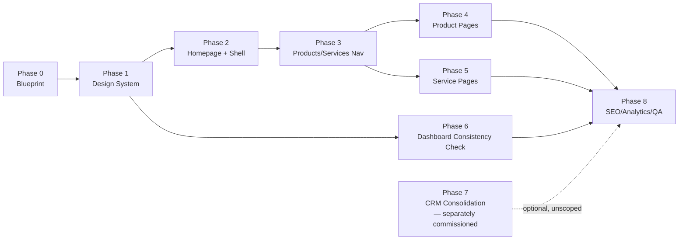

# SiteMint Digital — Platform Implementation Roadmap

> Documentation only — Checkpoint P0. No phase below has started. Each phase is a
> separate future checkpoint requiring its own owner approval before work begins,
> per the task brief's explicit instruction not to produce one giant implementation
> prompt.

## Cross-Phase Rules (apply to every phase below)

- One clear objective per phase; stop before unrelated work.
- Touch only the files listed as in-scope for that phase.
- `pnpm run typecheck` clean + relevant artifact build passes before any commit.
- Zero-line `git diff` on every protected file in root `CLAUDE.md` after every phase.
- No console errors on any touched route, light and dark where applicable.
- Each phase produces exactly one reviewable commit; does not auto-push, auto-
  deploy, or auto-merge; stops for owner review before the next phase starts.
- Rollback = revert the single commit; no phase leaves the repo in a half-migrated
  state (old route/component stays until the new one is verified, per Blueprint
  §21 expansion rule #... and the preservation principle in §22).

---

## Phase 0 — Audit and Blueprint Approval

- **Goal**: this checkpoint. Produce the five planning documents; get owner
  sign-off on open decisions (Blueprint §24) before Phase 1 starts.
- **Scope**: `docs/sitemint-platform/**` only.
- **Files/modules affected**: none application-side.
- **Dependencies**: none.
- **Risks**: none — no code changes.
- **Acceptance tests**: five documents exist, `git diff` shows only
  `docs/sitemint-platform/**`, working tree clean afterward.
- **Visual/accessibility/performance tests**: not applicable.
- **Database impact**: none. **Deployment impact**: none.
- **Estimated effort**: small.
- **Stop conditions**: any owner decision in Blueprint §24 still open blocks
  Phase 1 from starting on the affected area (e.g. color palette must be decided
  before Phase 1 token work begins).
- **Rollback**: revert the single P0 commit.

## Phase 1 — Shared SiteMint Design System

- **Goal**: implement the token system from `DESIGN_SYSTEM_DIRECTION.md` as the
  platform standard, starting with formalizing helpdesk's existing tokens as the
  canonical source and bringing `web-agency` onto the same neutral/semantic layer.
- **Scope**: `artifacts/web-agency/src/index.css` (token values only — no
  component rewrites yet), optionally a new shared reference (e.g.
  `docs/sitemint-platform/design-tokens-reference.md` or a future `lib/`
  package — package extraction is a judgment call for the phase's own planning,
  not decided here).
- **Dependencies**: Phase 0 owner decision on final palette (Blueprint §24.6).
- **Risks**: `web-agency`'s existing blue-branded pages will look visually
  "unfinished" until Phase 2 re-themes components — this phase changes tokens,
  not yet every component's usage of them; must be scoped and communicated as such.
- **Acceptance tests**: `web-agency` typecheck + build pass; helpdesk untouched
  (zero diff); no visual regression on components not yet migrated (they may look
  stale, not broken).
- **Visual tests**: side-by-side screenshot of new token values applied to a
  neutral test page.
- **Accessibility tests**: contrast-check new neutral/semantic tokens against
  both current `web-agency` component set and helpdesk's existing usage.
- **Performance tests**: font-loading unchanged (same font families already
  used); no new blocking requests.
- **Database impact**: none. **Deployment impact**: none (frontend-only, both
  apps unaffected functionally).
- **Estimated effort**: medium.
- **Stop conditions**: if contrast testing fails AA on any adopted token,
  halt and revise before proceeding to Phase 2.
- **Rollback**: revert token file changes; components keep working since Tailwind
  falls back to old values until re-themed.

## Phase 2 — Main Homepage and Global Shell

- **Goal**: redesign `Home.tsx`, `Navbar.tsx`, `Footer.tsx` using Phase 1 tokens
  and the homepage narrative below.
- **Scope**: `artifacts/web-agency/src/pages/Home.tsx`,
  `artifacts/web-agency/src/components/layout/{Navbar,Footer}.tsx`.
- **Dependencies**: Phase 1 complete.
- **Risks**: Navbar/Footer are used on every public page — a regression here is
  the highest-blast-radius single change in this whole program; requires the
  most thorough manual click-through of every public route afterward.
- **Acceptance tests**: every existing public route still renders correctly
  under the new Navbar/Footer; all existing nav links still resolve.
- **Visual tests**: desktop + mobile, light mode (dark mode not required for
  `web-agency` in MVP per PRD §34) screenshots of homepage and one other public
  page under the new shell.
- **Accessibility tests**: keyboard nav through new nav/footer, focus rings
  visible, `aria-current` on active nav item.
- **Performance tests**: homepage load time not regressed by any new motion
  (per Design doc motion budget).
- **Database impact**: none. **Deployment impact**: none.
- **Estimated effort**: large.
- **Stop conditions**: if the new nav set (Route doc §Recommended Navigation
  Direction) is not yet owner-approved, stop before this phase — nav structure
  must be locked before homepage build.
- **Rollback**: revert the phase commit; old Home/Navbar/Footer restored exactly.

## Phase 3 — Products/Services Navigation and Overview Pages

- **Goal**: build `/products/` and `/services/` overview pages and wire them into
  the Phase 2 nav.
- **Scope**: two new page files + route registration in `App.tsx`; no changes to
  any existing route.
- **Dependencies**: Phase 2 complete; owner decision on AI Toolkit inclusion
  (Blueprint §24.2).
- **Risks**: low — purely additive routes.
- **Acceptance tests**: both pages render, both reachable from nav, both list
  only real (non-fabricated) products/services.
- **Visual/accessibility/performance tests**: same battery as Phase 2, scoped to
  the two new pages.
- **Database impact**: none. **Deployment impact**: none.
- **Estimated effort**: medium.
- **Stop conditions**: none beyond the standing dependency.
- **Rollback**: remove the two new routes/files; no existing route affected.

## Phase 4 — Individual Product Landing Pages

- **Goal**: retokenize the existing `/ai-receptionist` page to the shared design
  system; build the new `/products/ai-toolkit` page (if approved in Phase 0/3).
- **Scope**: `artifacts/web-agency/src/pages/LandingReceptionist.tsx` (retokenize
  only, preserve all existing sections/copy structure), one new AI Toolkit
  marketing page.
- **Dependencies**: Phase 3 complete.
- **Risks**: `LandingReceptionist.tsx` is a long, section-heavy file — retokenizing
  without behavior change requires care around its interactive demo section.
- **Acceptance tests**: signup flow (`/ai-receptionist/signup`) untouched and
  still functional end-to-end; all anchor links (`#demo`, `#features`, etc.)
  still resolve.
- **Visual/accessibility/performance tests**: full page screenshot battery,
  desktop + mobile.
- **Database impact**: none. **Deployment impact**: none.
- **Estimated effort**: large.
- **Stop conditions**: any change to the signup form's submission behavior is
  out of scope — if retokenizing requires touching that logic, stop and split
  into a separate reviewed change.
- **Rollback**: revert the phase commit.

## Phase 5 — Individual Service Pages

- **Goal**: build six service pages (or sections within `/services/`, decided
  during phase planning) with real, non-fabricated copy.
- **Scope**: new page files under `artifacts/web-agency/src/pages/services/` (or
  equivalent), route registration only.
- **Dependencies**: Phase 3 complete.
- **Risks**: low — additive only.
- **Acceptance tests**: each service page reachable, each has a working
  Discovery CTA.
- **Database impact**: none. **Deployment impact**: none.
- **Estimated effort**: medium.
- **Stop conditions**: none.
- **Rollback**: remove new routes/files.

## Phase 6 — Customer Application Visual Consistency

- **Goal**: verify/adjust helpdesk's existing design system against the now-
  shared platform tokens (helpdesk is already the *source* of the shared tokens
  per Phase 1, so this phase is mostly verification, not rebuild).
- **Scope**: spot-check only; changes limited to any drift found, not a redesign.
- **Dependencies**: Phase 1 complete.
- **Risks**: helpdesk's backend/SMS locks (root `CLAUDE.md`) remain absolute —
  this phase is UI-only and must re-verify zero-diff on every protected file,
  exactly as every prior helpdesk UI phase has (see `SESSION_HANDOFF.md`
  precedent).
- **Acceptance tests**: helpdesk typecheck + build pass; protected-file diff = 0.
- **Database impact**: none. **Deployment impact**: none.
- **Estimated effort**: small.
- **Stop conditions**: any drift requiring more than a token/class tweak gets
  split into its own separately-scoped follow-up, not absorbed into this phase.
- **Rollback**: revert the phase commit.

## Phase 7 — SiteMint Internal Admin and CRM Consolidation

- **Goal**: address the genuine CRM gaps flagged in
  `ROUTE_AND_NAVIGATION_ARCHITECTURE.md` (standalone `clients`/`proposals` views,
  `support`, `content`, `portfolio`-as-CRM-content) — **only if and when the
  owner separately commissions this work**; this phase is a placeholder pointer,
  not a committed scope.
- **Scope**: TBD in its own future PRD; explicitly not defined here per the "no
  large feature-list bundling" instruction in the source brief.
- **Dependencies**: Phase 0 owner decision on whether CRM route reorganization
  happens at all (Blueprint §24.5).
- **Risks**: highest of any phase — touches locked-adjacent, revenue-critical CRM
  surface (`ARCHITECTURE.md` DEVELOPMENT_RULES.md change-budget and locked-engine
  rules apply in full).
- **Acceptance tests**: TBD per its own PRD.
- **Database impact**: TBD — likely additive-only if any (per root CRM push-mode
  convention). **Deployment impact**: TBD.
- **Estimated effort**: very large (if pursued at all).
- **Stop conditions**: do not begin without a dedicated PRD and explicit owner
  go-ahead — this phase is intentionally the least-specified in this roadmap.
- **Rollback**: N/A until scoped.

## Phase 8 — SEO, Accessibility, Performance, Analytics, and Release QA

- **Goal**: close the SEO gap (per-route titles/meta, structured data), select
  and install an analytics vendor with the event list from the PRD (§24), and run
  a full accessibility/performance pass across every touched page from Phases 1–6.
- **Scope**: `index.html`/per-route meta handling in `web-agency` (and `ai-
  toolkit` if it's been integrated by Phase 4), one new analytics dependency +
  its initialization code.
- **Dependencies**: owner analytics-vendor decision (Blueprint §24.3); all prior
  phases complete.
- **Risks**: analytics script must not become render-blocking or introduce a
  new third-party security surface without review (PRD §28).
- **Acceptance tests**: unique `<title>`/meta per route verified; sitemap.xml
  includes only indexable routes; `noindex` confirmed on all admin/dashboard
  routes; core events firing (verified via vendor's debug tooling, not by
  fabricated numbers).
- **Visual tests**: none new. **Accessibility tests**: full AA contrast +
  keyboard-nav sweep across every route touched since Phase 1. **Performance
  tests**: Lighthouse pass on homepage and one product page, compared against a
  Phase-0 baseline captured at the start of this phase (no baseline exists yet —
  capturing one is part of this phase's own acceptance criteria).
- **Database impact**: none. **Deployment impact**: this phase is the release-
  readiness gate; still does not itself deploy — deployment remains a separate,
  explicitly-approved action per the standing "never deploy without approval" rule.
- **Estimated effort**: large.
- **Stop conditions**: no phase after this one is currently planned — Phase 8 is
  the closing QA gate for this roadmap's MVP scope (PRD's MVP Platform Scope).
- **Rollback**: revert the phase commit; analytics can be disabled via its own
  config flag without a code revert if issues surface post-launch.

---

## Sequencing Summary

Each arrow is a hard dependency and a stop point: no phase begins before its
predecessor is reviewed, committed, and (if the owner chooses) pushed as a branch
backup — mirroring the precedent already set by the voice-platform program's
B1→B2→B3 sequencing in `docs/ai-receptionist/VOICE_PLATFORM_UI_UX.md` §16.
