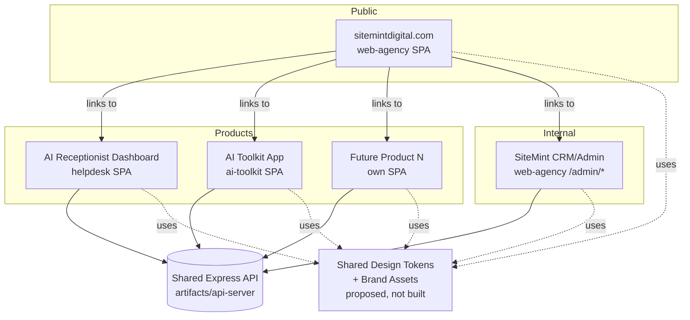

# SiteMint Digital — Master Platform Blueprint

> **Status**: Checkpoint P0 — documentation only. Nothing in this document has been
> implemented. No route, redirect, component, or database object described here
> exists yet unless explicitly marked "currently implemented."
> **Baseline SHA**: `28d5eef00c47688940017982fcbd9a90c109a331`
> **Branch**: `claude/sitemint-platform-blueprint-j6snjs`
> **Author context**: produced from direct repository inspection (routes, package.json
> files, CSS/token files, API route registration) — see companion
> `ROUTE_AND_NAVIGATION_ARCHITECTURE.md` for the full inventory this blueprint is built on.
> **Checkpoint P0.1**: the owner decisions in §24 below have been resolved (except
> analytics vendor selection, which stays deliberately open — see §24.3). Where this
> document is silent on a point Checkpoint P0.1 addressed, the correction lives in
> the companion document it most directly affects (PRD, Route doc, Design doc, or
> Roadmap) rather than being duplicated here.

---

## 1. Executive Vision

SiteMint Digital is repositioning from "a company that builds websites and one AI
product" into a connected technology company: one brand, multiple products and
services, one shared CRM operating the whole business, and a design system that lets
new products launch without re-deriving navigation, auth, or visual language each
time. This checkpoint (P0) produces the planning documents that make that transition
buildable in controlled, reviewable phases. It changes no code.

## 2. SiteMint Positioning

SiteMint Digital is the umbrella brand. Its public identity is not "the website
company" and not "the AI Receptionist company" — it is a technology partner that
builds and operates digital infrastructure (websites, AI products, CRM/automation)
for service businesses. The AI Receptionist and AI Toolkit are products *of*
SiteMint Digital, not separate companies, and must not visually or navigationally
imply otherwise.

## 3. Business Model

Three revenue lines exist or are planned today:
1. **Project/service revenue** — websites, web apps, CRM builds, SEO, automation
   (one-time + retainer), sold via the Discovery → Proposal → Deal pipeline that
   already exists in the CRM.
2. **Product subscription revenue** — AI Receptionist (`trial`/`paid` via Stripe,
   implemented) and future SiteMint software products (AI Toolkit currently sells as
   a one-time Stripe checkout, not a subscription).
3. **Internal efficiency** — the CRM is not sold; it is the operating system that
   makes the other two lines profitable at SiteMint's own headcount.

## 4. Platform Model

"Platform" here means: one shared identity system, one shared design language, one
shared CRM, and a navigation/route convention that any new product plugs into —
not a single shared codebase or a single shared runtime. The current repo already
reflects a **federated** platform model (see §17): each product is its own Vite SPA
artifact behind a shared Express API, not one monolithic frontend. The blueprint
recommends *keeping* this model and unifying it at the design-token and navigation
layer, not by merging codebases.

## 5. Products vs. Services vs. Solutions

See the Product Taxonomy in §12 below for full definitions. In one line: **products**
are software SiteMint owns and operates for customers (AI Receptionist, AI Toolkit);
**services** are delivery work SiteMint performs for a customer's own asset
(building their website, their CRM, their automation); **solutions** are
problem-framed marketing groupings that point at a mix of products and services
(e.g. "never miss a lead" points at AI Receptionist + a rebuilt contact flow).

## 6. Public Website Role

`sitemintdigital.com` (currently `artifacts/web-agency`, served at `/`) is the
top-of-funnel identity surface for the whole company: it must explain what SiteMint
is, house the Products/Services/Solutions marketing pages, carry the Discovery
lead-capture flow, and link out to each product's own experience (AI Receptionist
dashboard, AI Toolkit checkout) and to the private CRM/admin entry point. It is not
itself a product dashboard.

## 7. Customer Application Role

Each product owns its own authenticated application, on its own auth system, styled
in its own product-appropriate way but sharing the SiteMint brand mark, typography
family, and interaction conventions defined in `DESIGN_SYSTEM_DIRECTION.md`. Today
only the AI Receptionist has a real customer application (`artifacts/helpdesk`, at
`/ai-receptionist/dashboard`). AI Toolkit is currently checkout-only (no logged-in
customer area). Future products follow the same pattern: their own SPA artifact,
their own auth if needed, shared brand skin.

## 8. Internal Admin Role

`artifacts/web-agency`'s `/admin/*` tree is SiteMint's own operating system — CRM,
discovery review, receptionist account admin — and is explicitly **not** a
customer-facing surface. It must never be indexed, never share auth with any
customer product, and must serve the whole company, not just one product line (it
already does: `receptionist-accounts` and `intake-cases` sit alongside standard
CRM leads/deals/campaigns under the same `/admin/crm/*` tree today).

## 9. Shared Platform Capabilities

Capabilities every current and future product should be able to draw on without
rebuilding them:
- Shared visual/design-token system (proposed in `DESIGN_SYSTEM_DIRECTION.md` —
  **does not exist today**, see §10).
- Shared brand mark, wordmark, favicon convention.
- One CRM as the record of truth for every lead/customer touchpoint regardless of
  which product or service generated it.
- A common navigation/IA convention (top-level Products / Services / Solutions
  pattern) so a new product's marketing page has an obvious home.
- A common lead-capture → CRM ingestion path (Discovery form, Contact form, and
  future product-specific forms all landing in `crm_leads`/`discovery_submissions`).

## 10. Current-State Assessment

Grounded in direct inspection (full detail in `ROUTE_AND_NAVIGATION_ARCHITECTURE.md`):

| Area | State |
|---|---|
| Public marketing site | Implemented — `web-agency` `/`, `/services`, `/pricing`, `/portfolio`, `/about`, `/contact`, `/discovery` |
| AI Receptionist marketing | Implemented — `/ai-receptionist`, `/ai-receptionist/signup` (unlinked from main nav) |
| AI Receptionist product | Implemented — `helpdesk` SPA at `/ai-receptionist/dashboard`, cookie auth, Stripe billing |
| AI Toolkit | Implemented as a **standalone, unlinked** Vite SPA (`artifacts/ai-toolkit`) — Stripe one-time checkout, no nav link from web-agency, no logged-in area |
| Internal CRM | Implemented and extensive — 25+ `/admin/crm/*` routes already cover leads, deals, pipeline, campaigns (with sequences/scheduler), behavioral intelligence, communications, discovery, receptionist accounts, intake cases |
| Shared design system | **Does not exist.** `web-agency` and `helpdesk` each define an independent Tailwind v4 token set with different color values (web-agency: deep-blue primary; helpdesk: evergreen/mint primary) though both happen to use the same two Google Fonts (Plus Jakarta Sans + Playfair Display) |
| Shared navigation/brand | **Does not exist.** No shared logo component, no shared nav config, no cross-linking between web-agency and ai-toolkit |
| SEO | Partial — static per-app `<title>`/meta/JSON-LD only (no per-route metadata, no `react-helmet`); `sitemap.xml`/`robots.txt` exist only for web-agency |
| Analytics | **Missing entirely** — no analytics/tracking library found in any artifact |
| Products/Services/Solutions IA | **Missing** — no `/products`, `/services` is a single flat page, no `/solutions` |
| mockup-sandbox | Internal dev tool only (component preview), not a product surface |

## 11. Recommended Future-State Architecture

Keep the federated-artifacts model; add a thin shared layer:



No artifact merges into another. A2 new shared package (design tokens) is the only
new structural piece this blueprint recommends, and it ships in Phase 1 of
`IMPLEMENTATION_ROADMAP.md` — not in this checkpoint.

## 12. Product Taxonomy

- **Product** — software SiteMint builds once and operates for many customers under
  its own subscription/purchase (AI Receptionist, AI Toolkit, future products).
  Has its own app, its own onboarding, is not customized per-customer beyond
  configuration.
- **Service** — bespoke delivery work performed for one customer's own asset
  (their website, their CRM instance, their SEO). Billed as a project or retainer,
  not a subscription to a SiteMint-owned app.
- **Solution** — a problem-framed marketing grouping, not a separate deliverable.
  Points visitors at the right mix of products/services for their situation ("lead
  capture," "customer support," "operational efficiency"). Solutions pages sell;
  they do not ship independent code.
- **Platform** — the umbrella: SiteMint Digital itself, encompassing every product,
  service, and the shared CRM/brand/design layer.
- **Customer application** — the authenticated app a product customer logs into
  (helpdesk today; future product apps later).
- **Internal admin system** — SiteMint's own CRM/ops tooling (`/admin/*`), used by
  staff only, never customer-facing.
- **Shared capability** — infrastructure reused across products/services without
  being sold on its own (design tokens, CRM ingestion, auth patterns, brand assets).

**Navigation/copy recommendation**: use "Products" and "Services" as distinct
top-level nav items (see `ROUTE_AND_NAVIGATION_ARCHITECTURE.md` §Navigation). Do
not expose "Solutions" as a third top-level item in MVP — fold solution-style
messaging into the homepage narrative and into Products/Services pages instead,
to avoid a nav item with thin, overlapping content (see rationale in that doc).

## 13. Product Hierarchy

```
SiteMint Digital (platform)
├── AI Receptionist (product) — implemented
├── AI Toolkit (product) — implemented, unlinked from main site
└── [Future SiteMint products] — none yet; do not invent placeholders
```

## 14. Service Hierarchy

```
Services
├── Websites (implemented as delivery work; sold via /services + Discovery)
├── Web Applications
├── Custom CRM Systems
├── Business Automation
├── SEO & Digital Growth
└── Maintenance & Support
```
All six already exist as line items in the current `Footer.tsx` services list (no
links yet) and as informal scope in `/services`. None require new code to exist as
*concepts*; MVP work is giving each a real page (see PRD §MVP scope).

## 15. Solution Hierarchy

```
Solutions (marketing framing only — not separate routes in MVP)
├── Lead capture
├── Customer support
├── Business automation
├── Digital presence
├── Client management
├── Follow-up systems
├── Appointment workflows
└── Operational efficiency
```
Recommendation: treat these as homepage/Products/Services messaging angles, revisit
a dedicated `/solutions` IA post-MVP only if content volume justifies it (see PRD
Non-Goals).

## 16. Customer Journeys

**Prospect → AI Receptionist customer**: sitemintdigital.com → Products →
AI Receptionist landing (`/ai-receptionist`) → signup (`/ai-receptionist/signup`)
→ helpdesk dashboard (`/ai-receptionist/dashboard`) → Stripe upgrade.

**Prospect → Service client**: sitemintdigital.com → Services or homepage CTA →
Discovery form (`/discovery`) → CRM lead → Proposal/SOW → Deal → Client → Project.

**Prospect → AI Toolkit customer**: currently no path exists from the main site.
This is an approved gap to close (§24 Decision #2) — sitemintdigital.com →
Products → AI Toolkit page → standalone checkout app — implemented in a future
Phase 3/4 checkpoint, not in this documentation-only checkpoint.

## 17. Internal Staff Journeys

Staff log in at `/admin` (Bearer token, `localStorage`) and operate the entire
business from `/admin/crm/*`: lead intake and qualification, discovery review,
proposal/SOW generation, deal/pipeline management, campaign automation, receptionist
account administration, communications, and reporting — all already built (see
`ARCHITECTURE.md` root doc for full module status).

## 18. System Boundaries

- **Auth boundary 1**: CRM/Admin — Bearer token in `localStorage`, resets on server
  restart, protects all `/admin/*`.
- **Auth boundary 2**: AI Receptionist customer — httpOnly cookie
  `receptionist_session`, DB-backed, protects helpdesk routes via `/me` check.
- **No boundary today**: AI Toolkit has no authenticated area (checkout only).
- **Corrected framing (P0.1)**: these two systems are not merged during the
  public-site and design-system phases (MVP), and existing login routes, session
  behavior, and authorization rules are preserved unchanged throughout this
  program — that restriction is binding today. It is **not** a claim that the
  systems must remain separate *permanently*. A future, separately-scoped
  security PRD may evaluate a shared SiteMint **customer** identity across
  customer-facing products (e.g. AI Receptionist + AI Toolkit), but any such
  change is explicitly out of scope for this platform blueprint and must never be
  treated as implied by shared visual design. See the full statement in
  `PRODUCT_REQUIREMENTS_DOCUMENT.md` §18 (Authentication Requirements) and the
  Authentication Boundary Decision below.

## 19. Public vs. Authenticated Areas

| Area | Auth | Indexable |
|---|---|---|
| `web-agency` public pages (`/`, `/services`, `/pricing`, `/portfolio`, `/about`, `/contact`, `/discovery`, `/ai-receptionist*`) | None | Yes |
| `ai-toolkit` public pages (`/`, `/thank-you`, `/cancel`) | None | Yes for `/`; `noindex` for thank-you/cancel |
| `helpdesk` (`/ai-receptionist/dashboard/*`) | Cookie session | No — `noindex` |
| `web-agency` `/admin/*` | Bearer token | No — `noindex`, and ideally not linked from any public page's HTML |

## 20. Shared vs. Product-Specific Functionality

Shared: brand mark, font family choice, CRM ingestion, Discovery/Contact forms,
Express API host. Product-specific: auth mechanism, accent color, dashboard IA,
billing model (subscription vs. one-time). The design system (Doc 4) formalizes
which tokens are shared (neutrals, radii, motion durations) vs. which are
product-accent (mint for AI Receptionist; a distinct but harmonious accent for
future products, TBD per product at launch).

## 21. Future Expansion Rules

1. A new product gets its own artifact (own `package.json`, own Vite app) — never
   grafted into `web-agency` or `helpdesk`.
2. A new product's marketing page lives under `/products/<slug>` on the main site
   (post-MVP nav pattern, see Route doc) and links out to the product's own app.
3. A new product must consume the shared design tokens for neutrals/typography/
   spacing/motion, and may define its own accent color, following the pattern
   `DESIGN_SYSTEM_DIRECTION.md` sets for AI Receptionist's mint.
4. A new product's leads/customers must be reachable from the CRM — either via a
   new `crm_*`-adjacent table or an existing one; never a silent parallel database.
5. No new product ships without a feature flag if it has any unfinished surface
   visible to real customers (precedent: `VOICE_PLATFORM_ENABLED`).

## 22. Key Risks

- **AI Toolkit is an orphaned product** — real, deployed, but invisible from the
  main site and CRM. Left as-is, it will keep diverging stylistically and
  functionally from the rest of the platform.
- **No shared design tokens today** — two different "SiteMint" color identities
  currently exist in the wild (web-agency's blue vs. helpdesk's mint/evergreen).
  Public confusion risk if both surfaces are seen close together.
- **No analytics anywhere** — every conversion/engagement claim in this and future
  planning docs is currently unmeasurable. Must be treated as a real gap, not an
  afterthought.
- **CRM `/admin/crm/*` routes are flat**, not nested per the aspirational structure
  in the task brief (e.g. `/admin/crm/leads/:id/dna`, `/admin/crm/intelligence/*`
  already exist under different names than initially proposed) — route docs must
  describe reality, not the aspirational list, and any renaming is a deliberate,
  separately-approved migration (see Route doc, redirects).
- **Auth-system rewrite mistaken for a design task** — the highest-consequence
  mistake a future phase could make is treating shared visual design as license
  to merge or rewrite the CRM Bearer-token and AI Receptionist cookie-session
  systems "to make things look unified." MVP scope keeps both systems exactly as
  they are; any future consolidation is a dedicated, separately-approved security
  initiative (see Authentication Boundary Decision below), never a side effect of
  a navigation or homepage phase.
- **Scope-creep risk in this very checkpoint** — the source brief describes a huge
  surface area; documents must stay descriptive/planning-only and resist the urge
  to start "just fixing" small things (e.g. the AI Toolkit orphan gap) during P0.

## 23. Non-Goals

- Not building a unified single-SPA frontend across products.
- Not merging CRM/Admin auth with any product's customer auth.
- Not implementing `/solutions` as a routed IA section in MVP.
- Not fabricating customer counts, revenue figures, or testimonials anywhere in
  these documents or in future copy without owner-supplied facts.
- Not touching AI Receptionist voice-platform work — that program continues on its
  own approved track (`docs/ai-receptionist/*`) independent of this blueprint.
- Not renaming any existing route in this checkpoint.

## 24. Decisions Requiring Owner Approval

> **Status as of Checkpoint P0.1**: items 1, 2, 4, 5, and 6 below are **resolved**.
> Item 3 (analytics vendor) is **deliberately kept open** — see §24.3. Resolutions
> are recorded in the Architecture Decision Log at the end of this document and
> propagated into the four companion documents.

1. ~~Whether `/solutions` becomes a real routed section post-MVP or stays
   messaging-only permanently.~~ **Resolved**: `/solutions` is not a top-level MVP
   navigation item. Solution-oriented content may appear on the homepage, inside
   product pages, inside service pages, in future SEO landing pages, and in the
   footer once real solution pages exist. Route extensibility for a future
   `/solutions` tree is explicitly preserved — this is a sequencing decision, not
   a permanent rejection.
2. ~~Whether AI Toolkit gets a `/products/ai-toolkit` marketing page and CRM
   integration in Phase 3/4, or stays intentionally separate.~~ **Resolved**: AI
   Toolkit is an approved current SiteMint product (alongside AI Receptionist) and
   **must** be integrated into the main SiteMint website and into the Products
   navigation. This closes the "orphaned product" risk in §22. No additional
   public products are approved beyond these two; future products follow the
   platform taxonomy (§12) and go through this same owner-approval process.
3. Which analytics tool to adopt (none is currently installed; PRD lists
   requirements but not a vendor choice). **Deliberately unresolved.** Vendor
   selection belongs to `IMPLEMENTATION_ROADMAP.md` Phase 8 (SEO, Accessibility,
   Analytics, and Release QA), not to this checkpoint or to P0.1. The Blueprint
   and PRD define required conversion events, privacy expectations, dashboard
   needs, attribution needs, and performance constraints (PRD §24) so that vendor
   selection is an implementation detail, not a re-litigation of requirements.
4. ~~Final top-level navigation set...~~ **Resolved**: **Products, Services, Work,
   Pricing, Company, Client Login, Start a Project** — see
   `ROUTE_AND_NAVIGATION_ARCHITECTURE.md` §14 and §Recommended Navigation
   Direction for the approved interaction type per item. Neither Solutions nor
   Resources is a top-level MVP item (see #1 above and the Resources note below).
5. ~~Whether the CRM's existing route names... should ever be reorganized...~~
   **Resolved**: existing CRM routes are **not** reorganized, renamed, or removed
   during the public-website redesign or design-system work. They remain fully
   operational — the CRM continues to serve the entire SiteMint company exactly
   as it does today. Any future consolidation begins with an admin information
   architecture and shell review (not a route rename), and any actual route
   migration, alias, or redirect requires its own separately approved checkpoint
   with a dedicated CRM-specific PRD (see `ROUTE_AND_NAVIGATION_ARCHITECTURE.md`
   §Admin/CRM Structure Evaluation and `IMPLEMENTATION_ROADMAP.md` Phase 7).
6. ~~Final SiteMint color palette...~~ **Resolved (as a starting foundation, not a
   final ruling)**: the existing, already-implemented helpdesk evergreen/mint
   token system is approved as the **starting foundation** for the platform-wide
   design system. This is not a declaration that every current helpdesk color
   value is permanently final — the tokens still require a dedicated
   accessibility, contrast, and visual-quality review before broad adoption (see
   `DESIGN_SYSTEM_DIRECTION.md` §Proposed Color Direction and its "Foundation, Not
   Final" note). No broad visual rewrite of `web-agency` occurs before that review
   and the shared token/component set are formally approved.

**Also resolved in Checkpoint P0.1** (not originally numbered in P0):

7. Resources (as a nav concept) is not a top-level MVP navigation item — no blog,
   guide, case-study, or template content exists in the repository today. It may
   be added post-MVP once such content genuinely exists. Route extensibility for
   a future `/resources` tree is preserved.
8. Authentication boundaries — corrected framing. See §18 above and the full
   Current State / MVP / Future statement in `PRODUCT_REQUIREMENTS_DOCUMENT.md`
   §18. In one line: unchanged for MVP, never merged as a side effect of visual
   work, and any future shared **customer** identity is a distinct, dedicated
   security initiative that never implies internal CRM/admin access.
9. Roadmap phase numbering and the next implementation checkpoint — see
   `IMPLEMENTATION_ROADMAP.md` header note and its new Phase 1A entry.

---

## Architecture Decision Log (Checkpoint P0)

| # | Decision | Status |
|---|---|---|
| 1 | SiteMint is the umbrella company and platform brand | **Approved** |
| 2 | Products, services, and solutions are separate concepts | **Approved** |
| 3 | AI Receptionist is one SiteMint product, not the entire company | **Approved** |
| 4 | AI Toolkit is one SiteMint product | **Approved** |
| 5 | The internal CRM serves the entire SiteMint company | **Approved** (already true in practice) |
| 6 | Vapi and Solvea are references only | **Approved** (carried from `docs/ai-receptionist/VOICE_PLATFORM_UI_UX.md`) |
| 7 | Provider names are not ordinary customer-facing branding | **Approved** (carried from same source) |
| 8 | The implementation must be phased | **Approved** — see `IMPLEMENTATION_ROADMAP.md` |
| 9 | Existing working functionality must be preserved | **Approved** — binding, see §22 Risks |
| 10 | Shared design-system work precedes broad page redesign | **Approved** — Phase 1A then Phase 1 before Phase 2+ in roadmap |
| 11 | `/solutions` is messaging-only in MVP, not a routed top-level nav item; route extensibility preserved | **Approved (P0.1)** |
| 12 | AI Toolkit is an approved product and must be integrated into the main site + Products nav | **Approved (P0.1)** |
| 13 | Final MVP nav set: Products, Services, Work, Pricing, Company, Client Login, Start a Project | **Approved (P0.1)** |
| 14 | Existing helpdesk evergreen/mint tokens are the starting foundation for the platform design system, pending accessibility/contrast/visual-quality review — not permanently final | **Approved as foundation (P0.1)** |
| 15 | `/resources` is not a top-level MVP nav item; may be added post-MVP once real content exists; route extensibility preserved | **Approved (P0.1)** |
| 16 | Existing CRM routes are not reorganized/renamed/removed during public-site or design-system work; any future migration requires a separate approved checkpoint | **Approved (P0.1)** |
| 17 | Authentication boundaries stay unchanged for MVP; a future shared **customer** identity is a distinct future direction, never an MVP task, and never implies internal CRM/admin access | **Approved (P0.1)** — see §18 |
| 18 | Analytics vendor selection | **Deliberately open** — belongs to Roadmap Phase 8 (§24.3) |
| 19 | Roadmap is Phase 0 through Phase 8 (nine numbered phases); next implementation checkpoint after blueprint approval is Phase 1A (design-token audit and shared token specification) | **Approved (P0.1)** — see `IMPLEMENTATION_ROADMAP.md` |
